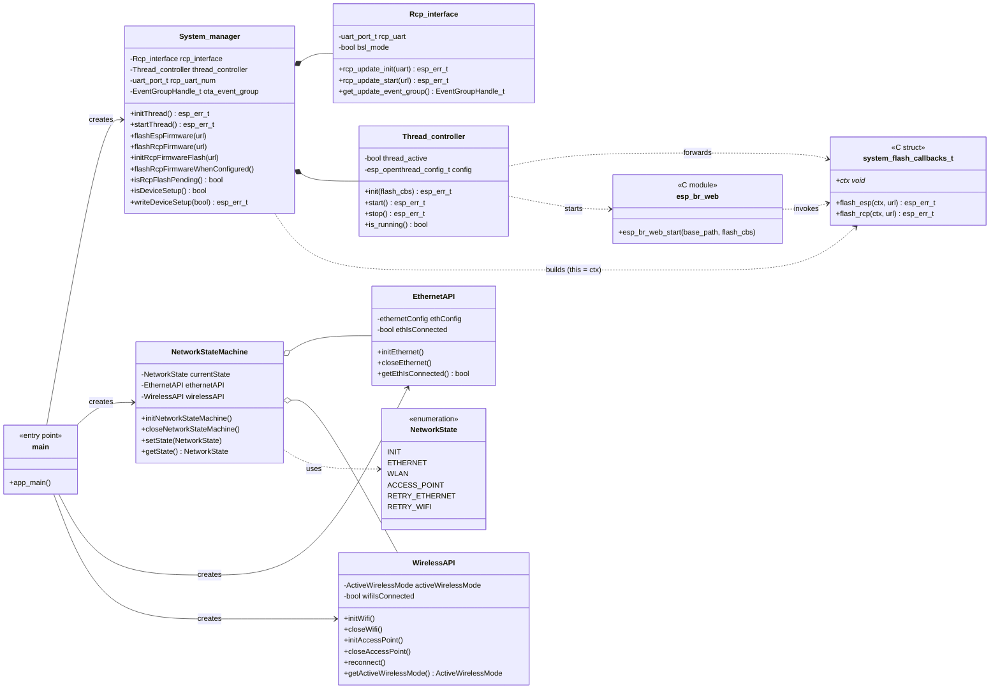

# CZC - OpenThreadBorderRouter Firmware ALPHA

This Firmware is in the ALPHA Phase and far away from being complete!

## Known Issues

This firmware is in an early alpha stage. Known issues are tracked as
[GitHub Issues](https://github.com/codm/czc-ot-fw/issues). If you run into a
problem that isn't listed there, please open a new issue with as much detail
as possible (firmware version, steps to reproduce, log output).

Known Issues:

- Firmware downloads over a Wi-Fi connection are not yet possible (LAN only).
- Long startup time on first boot, caused by the RCP firmware download and flash process.
- No visual feedback on the CZC during setup or firmware updates.
- The web interface is unreachable if the RCP is not configured correctly.
- SoftAP network scanning does not work.
- SoftAP closes after invalid or non-existent network credentials are submitted.
- Feedback messages in the SoftAP configuration flow are unclear.

### Capturing Debug Output

When reporting an issue, serial log output is extremely helpful. Each release provides a
**debug build** with verbose logging enabled (see [Setup](#setup)) — please use this
build when capturing logs.

1. **Install a serial terminal**, e.g. [CoolTerm](https://freeware.the-meiers.org/) (or
   any other serial terminal of your choice).

2. **Connect the CZC**: plug it into your PC via USB (serial console) and into your
   network via a LAN cable.

   Once booted, the web interface is reachable at [http://esp-ot-br.local](http://esp-ot-br.local).

3. **Configure CoolTerm**:
   - Open "Options".
   - Under "Port", select the USB port the CZC is connected to.
   - Set the baud rate to **115200**.
   - Leave all other settings at their default values.
   - Click "OK", then "Connect".

   On Windows the COM port can be found in the Device Manager. On Linux it is usually
   listed under `/dev/ttyUSBx` (FTDI).

4. **Reproduce the issue** you want to report.

5. **Save the serial output**: CoolTerm shows all debug prints sent by the ESP. For
   longer captures, enable **Connection → File Capture** beforehand to log everything to
   a file.

   Please attach the captured output to your issue report.

## Setup

1. Download the Binary from the Releases Tab. Make sure that you pick the firmware without the .ota suffix!

> NOTE: Each release provides two firmware variants — a **release build** (default,
> minimal logging) and a **debug build** (verbose serial logging). Use the debug build if
> you want to troubleshoot an issue or need to capture logs for a bug report, see
> [Capturing Debug Output](#capturing-debug-output).

2. Connect your CZC to LAN
> IMPORTANT NOTE: Currently ESP, RCP Firmware Updates are only supported via LAN. 

3. Open [ESP Webflasher](https://web.esphome.io/). Upload the downloaded firmware and flash the CZC.

4. Wait a few minuets until your ESP32 has successfully setup and started its Webinterface (This can take a while depending on your internet connection speed). 
> NOTE: After the first flash the ESP automatically Downloads the RCP firmware and flashes the Radio-Co-Processor. This does not yet have a visual output besides Debug prints.

5. Open [http://esp-ot-br.local](http://esp-ot-br.local) and you can start setting up a Thread Network!

## Overview

This Firmware implements an [OpenThread Border Router](https://openthread.io/guides/border-router) based on a ESP32 and a CC2652P7 Radio-Co-Processor (RCP).

This Project uses parts of the [Espressif example OTBR implementation](https://github.com/espressif/esp-idf/blob/master/examples/openthread/ot_br/README.md). 

## How to use Border Router

### Hardware Required
#### **Wi-Fi based Thread Border Router**

ESP32 pin | CC2652P7 pin
----------|-------------
   GND    |      G
   GPIO4  |      TX
   GPIO36 |      RX
   GPIO16 |      HW_RST

Firmware Baud: 921600

### Configure the project

```
idf.py menuconfig
```
OpenThread Command Line is enabled with UART as the default interface. Additionally, USB JTAG is also supported and can be activated through the menuconfig:

```
Component config → ESP System Settings → Channel for console output → USB Serial/JTAG Controller
```

#### Setup Repository

1. Clone the github repository

2. You need a .vscode folder in your Repository normally generated from the espressif IDF

   The files in this folder tell your development environment where your IDF etc. are installed on your device.

   **We suggest that you copy this folder from an example project created with your IDF if not automatically generated after clone.**

3. The required `dependencies.lock` file should get generated automatically while building the project. 

   If you encounter issues regarding the `webserver` component try adding the following lines under `dependencies:`

   ```yaml
      esp_ot_br_server:
         dependencies:
         - name: espressif/cjson
           rules:
           - if: idf_version >= 6.0
           version: ^1.7.19
         source:
           path: /$PROJ_PATH/ot_br/components/esp_ot_br_server
           type: local
         version: '*'
   ```

   and add `esp_ot_br_server` to the `direct_dependencies:` object. 

After these changes you should be able to build the project.

Before building and flashing it to your ESP you have to make a few changes to your IDF or you will get these errors:

```
E(1550) OPENTHREAD:[C] P-RadioSpinel-: RCP is missing required capabilities: 
E(1550) OPENTHREAD:[C] P-RadioSpinel-:     rx-timing
E(1550) OPENTHREAD:[C] P-RadioSpinel-:     rx-on-when-idle
```

- `rx-on-when-idle` has to be deactivated: -> Component config → OpenThread → Thread Core Features → Disable OpenThread radio capability rx on when idle

- more importantly: `rx-timing` is hardcoded in the espressif openthread sdk. In `$IDF_PATH/esp-idf/components/openthread/src/port/esp_openthread_radio_spinel.cpp` the constant `OT_RADIO_CAPS_RECEIVE_TIMING` part of the `s_radio_caps` object has do be deleted. 

Now you can build and flash the project to your ESP and the border router should initialize properly.

### Build, Flash, and Run

Build the project and flash it to the board, then run monitor tool to view serial output:

```
idf.py -p PORT build flash monitor
```

## Project Documentation

This Chapter gives Architectural and specific Project coding Documentation

### File Structure

```
czc_ot_firmware/
├── main/                         Application entry point
│   ├── main.cpp                  app_main(): boot sequence, network init,
│   │                             RCP-flash handling, starts the OTBR stack
│   └── Kconfig.projbuild         
│
├── components/
│   ├── system_manager/           Core orchestration layer (C++) — see below
│   ├── network/                  Network connectivity state machine (C++) — see below
│   └── esp_ot_br_server/         REST API + Web GUI (C) — see below
│
├── partitions.csv                Flash partition table of this firmware (OTA-enabled)
├── partition_table/
│   └── partitionTable.csv        Reference: partition table of the CZC Zigbee firmware
├── sdkconfig*                    ESP-IDF build configuration (defaults + CI variants)
├── .devcontainer/                VSCode Dev Container setup for ESP-IDF
└── image/                        Images used in this README
```

#### Components

##### `system_manager`

Owns the firmware/network lifecycle and bridges the C++ application core with the C
webserver component.

| File | Description |
|---|---|
| `System_manager` | Top-level orchestrator: ESP OTA updates, RCP flash scheduling, device-setup state (NVS) |
| `Thread_controller` | Starts/stops the OpenThread stack and the embedded webserver, hardware RCP reset |
| `Rcp_interface` | Downloads RCP firmware and flashes the CC2652 over UART via BSL |
| `sys_nvs_bind` | NVS persistence for a pending RCP flash and the device-setup flag |

##### `network`

Implements the Ethernet / Wi-Fi / SoftAP connectivity state machine — see
[components/network/README.md](components/network/README.md) for the full state diagram.

| File | Description |
|---|---|
| `NetworkStateMachine` | Switches between Ethernet, Wi-Fi, SoftAP and retry states |
| `EthernetAPI` | RMII Ethernet driver wrapper |
| `WirelessAPI` | Wi-Fi station + SoftAP wrapper |
| `nvs_bind` | NVS persistence for Wi-Fi credentials |

##### `esp_ot_br_server`

Embedded HTTP server providing the OpenThread REST API and the Web GUI, based on the
[Espressif OTBR example](https://github.com/espressif/esp-idf/blob/master/examples/openthread/ot_br/README.md).

| File | Description |
|---|---|
| `src/esp_br_web.c` | httpd server setup, route table and request handlers (incl. `/flash/esp`, `/flash/rcp`) |
| `src/esp_br_web_api.c` | OpenThread REST resource implementations (node info, dataset, topology, ...) |
| `src/esp_br_web_base.c` | JSON ⇄ OpenThread struct (de)serialization helpers |
| `src/esp_br_wifi_config.c` | SoftAP captive portal for the initial Wi-Fi setup |
| `frontend/` | Web GUI (HTML/CSS/JS), embedded into the SPIFFS image at build time |
| `include/`, `private_include/` | Public and private headers |

### Class Diagram

The diagram shows the main classes, their relationships, and how the C++ application
core (`system_manager`, `network`) connects to the C-based webserver
(`esp_ot_br_server`) via the `system_flash_callbacks_t` bridge described under
[API Endpoints](#api-endpoints).



### API Endpoints

Most REST endpoints are inherited from the
[Espressif OTBR example](https://github.com/espressif/esp-idf/blob/master/examples/openthread/ot_br/README.md)
and documented in
[`components/esp_ot_br_server/src/openapi.yaml`](components/esp_ot_br_server/src/openapi.yaml).

This project adds two **custom endpoints** for remote firmware updates:

| Endpoint | Method | Purpose | Request body | Response |
|---|---|---|---|---|
| `/flash/esp` | `POST` | Starts an OTA update of the ESP32 itself | `{ "url": "<firmware.ota.bin>" }` | `{ "status": "flashing", "message": "..." }` |
| `/flash/rcp` | `POST` | Schedules a firmware update of the CC2652 RCP (downloads now, flashes via BSL on next boot) | `{ "url": "<rcp_firmware.bin>" }` | `{ "status": "started" }` |

> **Testing:** A browser address bar cannot send POST requests. Use e.g. `curl`:
> ```bash
> curl -X POST http://<device-ip>/flash/rcp \
>      -H "Content-Type: application/json" \
>      -d '{"url": "https://example.com/rcp_firmware.bin"}'
> ```

#### Bridging the C webserver and the C++ application

The webserver (`esp_br_web.c`) is plain C, and all its handlers share the fixed signature
`esp_err_t handler(httpd_req_t *req)` — there is no room for extra parameters. The
`System_manager`, which actually performs the flashing, lives in C++ and is invisible to
the webserver. The two are connected through a small callback struct defined in
[`esp_br_web.h`](components/esp_ot_br_server/include/esp_br_web.h):

```c
typedef struct {
    esp_err_t (*flash_esp)(void *ctx, const char *url);
    esp_err_t (*flash_rcp)(void *ctx, const char *url);
    void *ctx;   // opaque pointer, cast back to System_manager* in the adapters
} system_flash_callbacks_t;
```

**How the struct travels through the program:**

1. `System_manager::initThread()` builds a `system_flash_callbacks_t`, pointing the
   function pointers at two `static` adapter functions and setting `ctx = this`.
2. `Thread_controller::init(flash_cbs)` receives the struct and forwards it unchanged to
   the webserver.
3. `esp_br_web_start(base_path, flash_cbs)` copies the struct **by value** into a static,
   file-scope variable `s_flash_cbs` — a copy is required because the original struct
   lives on `initThread()`'s stack and would be invalid once that function returns.
4. The HTTP handlers `esp_otbr_flash_esp_post_handler` / `esp_otbr_flash_rcp_post_handler`
   parse `{"url": ...}` from the request body and call
   `s_flash_cbs.flash_esp(s_flash_cbs.ctx, url)` / `s_flash_cbs.flash_rcp(...)`.
5. The static adapter functions `flash_esp_cb` / `flash_rcp_cb` (in `System_manager.cpp`)
   `static_cast` `ctx` back to `System_manager*` and call `flashEspFirmware(url)` /
   `initRcpFirmwareFlash(url)`.

This keeps the webserver completely free of `System_manager`/C++ knowledge while still
letting it trigger application-level actions. The same pattern can be reused for future
endpoints by extending `system_flash_callbacks_t` (or adding a similar struct).

### Firmware Flash

Both flash endpoints reboot the device once the update has been applied.

- **ESP firmware (`/flash/esp`)** — A standard ESP-IDF **OTA update**: the new image is
  streamed directly into the inactive `ota_0`/`ota_1` partition via `esp_https_ota_*`,
  the boot partition is switched, and the device reboots into the new firmware.

- **RCP firmware (`/flash/rcp`)** — The CC2652P7 cannot be updated over HTTP directly, so
  this happens in two steps:
  1. The RCP firmware binary is downloaded over HTTPS into the ESP32's OTA partition
     (used purely as temporary storage — the ESP's own firmware is *not* changed).
  2. After a reboot, the OpenThread stack is stopped and `Rcp_interface` flashes the
     downloaded image to the CC2652 over UART using TI's **BSL (Boot Strap Loader)**
     protocol (sync, erase, download, send-data, CRC, reset).

#### Github Download

Downloading firmware from GitHub servers is more complex than just downloading a file
from a local webserver hosted via Python.

You have to follow redirects and provide certificates for HTTPS.

It is also important to keep in mind that GitHub enforces a rate limit of 60 requests per
hour. Because of this it is better to host the firmware yourself rather than downloading
and fetching it from GitHub every time.

### Zigbee to OTBR complications

This OTBR firmware and the existing CZC Zigbee firmware currently use **different
partition tables**:

- OTBR (this repository): [`partitions.csv`](partitions.csv) — OTA-enabled, with
  `ota_0`/`ota_1` app partitions, an `ota_data` partition for the boot selector, and a
  `spiffs` partition for the web GUI.
- Zigbee firmware: partition table is generated automatically by PlatformIO at build
  time — no static `.csv` is checked into its repository.

An OTA flash via `/flash/esp` only overwrites the application binary inside the
*currently running* app partition — it does **not** rewrite the partition table itself.
Because the two firmwares currently use incompatible partition layouts, a device cannot
simply be switched between the Zigbee and the OTBR firmware over the air; doing so still
requires a full reflash via USB/serial.

For a remote, OTA-only switch between the Zigbee and OTBR firmware (without USB/laptop),
both firmwares need to share the same partition table. **This is work in progress** —
the Zigbee firmware's partition table will be adapted to match `partitions.csv` in a
future release.
