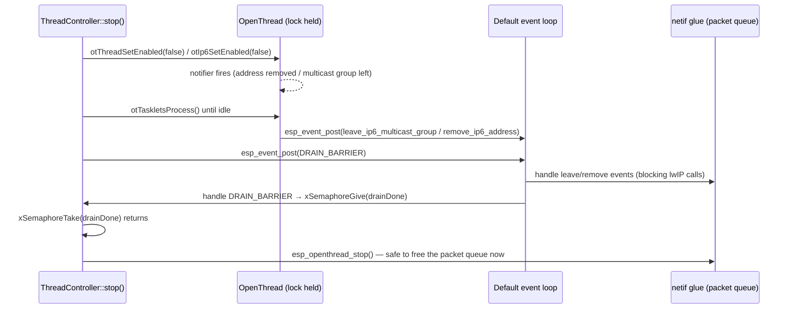
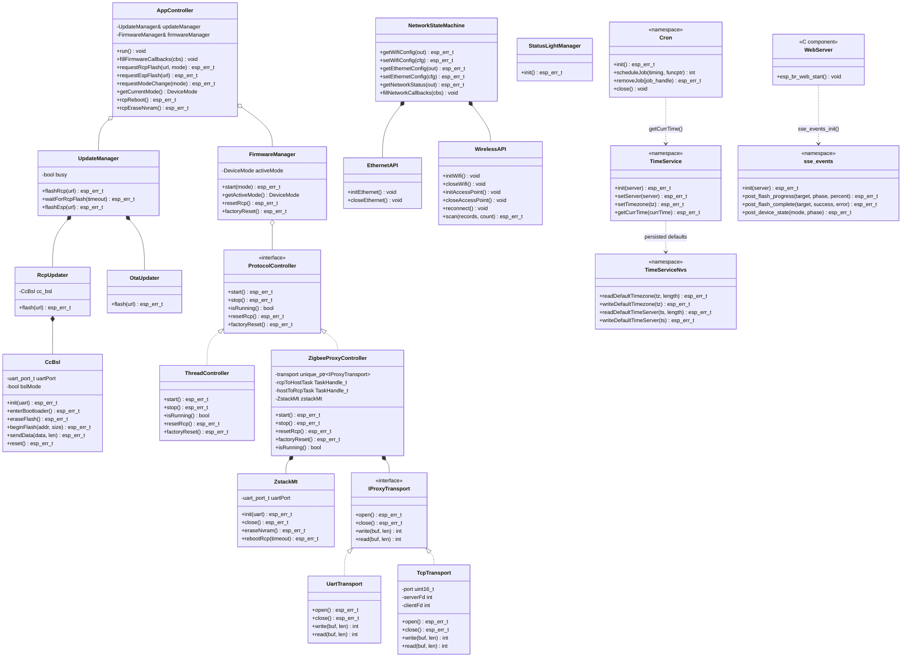
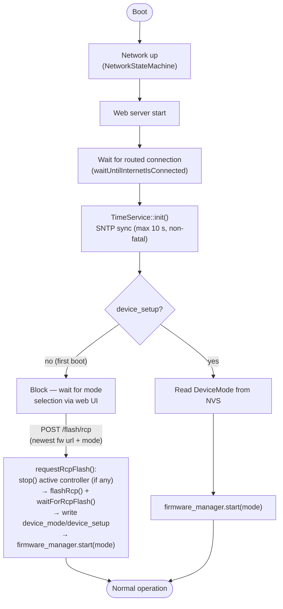

# CZC - OpenThreadBorderRouter Firmware ALPHA

This Firmware is in the ALPHA Phase and far away from being complete!

## Known Issues

This firmware is in an early alpha stage. Known issues are tracked as
[GitHub Issues](https://github.com/codm/czc-ot-fw/issues). If you run into a
problem that isn't listed there, please open a new issue with as much detail
as possible (firmware version, steps to reproduce, log output).

Known Issues:

- The web interface is unreachable if the RCP is not configured correctly (Only Thread mode is affected - this is an IDF Issue).

### Capturing Debug Output

When reporting an issue, serial log output is extremely helpful. Each release provides a
**debug build** with verbose logging enabled (see [Setup](#setup)) — please use this
build when capturing logs.

1. **Install a serial terminal**, e.g. [CoolTerm](https://freeware.the-meiers.org/) (or
   any other serial terminal of your choice).

2. **Connect the CZC**: plug it into your PC via USB (serial console) and into your
   network via a LAN cable.

   Once booted, the web interface is reachable at [http://codm-otbr.local](http://codm-otbr.local).

3. **Configure CoolTerm**:
   - Open "Options".
   - Under "Port", select the USB port the CZC is connected to.
   - Set the baud rate to **115200**.
   - Leave all other settings at their default values.
   - Click "OK", then "Connect".

   On Windows the COM port can be found in the Device Manager. On Linux it is usually
   listed under `/dev/ttyUSBx` (FTDI).

4. **Reproduce the issue** you want to report.

5. **Save the serial output**: CoolTerm shows all debug prints sent by the ESP. For
   longer captures, enable **Connection → File Capture** beforehand to log everything to
   a file.

   Please attach the captured output to your issue report.

## Setup

1. Download the Binary from the Releases Tab. Make sure that you pick the firmware without the .ota suffix!

> NOTE: Each release provides two firmware variants — a **release build** (default,
> minimal logging) and a **debug build** (verbose serial logging). Use the debug build if
> you want to troubleshoot an issue or need to capture logs for a bug report, see
> [Capturing Debug Output](#capturing-debug-output).

2. Connect your CZC to LAN
> IMPORTANT NOTE: Currently ESP, RCP Firmware Updates are only supported via LAN. 

3. Open [ESP Webflasher](https://docs.codm.de/en/zigbee/coordinator/web-installer/). Pick the appropriate OTBR Firmware Version.

4. Open [http://codm-otbr.local](http://codm-otbr.local). On first boot, the web interface will ask how you want to use your CZC. Select the desired mode — the matching RCP firmware is automatically downloaded and flashed. Progress is shown in the web interface.

5. Once setup is complete you can start using your CZC!

## WiFi / SoftAP

When no WiFi is configured and no Ethernet connection is available, the CZC opens an Access Point named `otbr-codm` with password `codmcodm`.

Connect to the AP and open **[http://192.168.4.1](http://192.168.4.1)** — a dedicated WiFi setup page is served (see [`esp_ot_br_server`](#esp_ot_br_server) below), where you can configure WiFi credentials or a static IP. Using Ethernet instead is recommended.

Once a connection is established, the device switches to normal operation mode automatically and the full web interface becomes available.

## Home Assistant Integration (Thread Border Router & Matter)

This guide explains how to integrate your CZC border router into Home Assistant using Thread and Matter over Thread.

---

### Prerequisites

- Home Assistant installed and running (on the same local network as your device)
- Home Assistant Companion App installed on your smartphone
- **Bluetooth enabled** on your smartphone (required for the pairing process)
- Your smartphone must be connected to the **same local network** as Home Assistant

---

### Step 1 — Install the Thread Integration

1. In Home Assistant, navigate to **Settings → Devices & Services**.
2. Click **+ Add Integration** and search for **Thread**.
3. Install the Thread integration.

---

### Step 2 — Add a Thread Border Router

1. In **Settings → Devices & Services**, click the **gear icon (⚙)** next to the Thread integration to open its settings.
2. Click the **three-dot menu (⋮)** in the top-right corner.
3. Select **Add Thread Border Router** and follow the on-screen instructions.
4. You will be prompted fill in the URL of the OTBRs REST API: `http://device-ip` or `http://codm-otbr.local`.
5. Once added, open the border router's details and select **Make Preferred Network** to designate it as the primary Thread network.

---

### Step 3 — Install the Matter Integration (for Matter over Thread)

If your device uses **Matter over Thread**, you also need the Matter integration:

1. Navigate to **Settings → Devices & Services**.
2. Click **+ Add Integration**, search for **Matter**, and install it.
3. During setup, you will also be prompted to install the **Matter Server** (the commissioner add-on). Install it and wait for it to start — this component handles all Matter commissioning and communication.

---

### Step 4 — Connect Your Device

1. Open the **Home Assistant Companion App** on your smartphone.
2. Go to **Settings → Companion App → Troubleshooting → Synchronize Thread Credentials**. This ensures your phone shares the Thread network credentials with Home Assistant so it can act as a commissioning bridge.
3. Back in Home Assistant, go to **Settings → Devices & Services → Devices** and click **+ Add Device**.
4. **Put your device into pairing mode** (refer to your device's documentation for how to do this).
5. **Scan the QR code** displayed on or shipped with your device to complete commissioning.

---

### Troubleshooting

#### Pairing fails or device is not found

- Make sure **Bluetooth is enabled** on your phone — it is required during the commissioning process even if the device ultimately connects via Thread.
- Confirm your phone is on the **same local network** as your Home Assistant instance.
- Try **clearing the cache** of the Home Assistant Companion App: on Android go to *App Info → Storage → Clear Cache*; on iOS, delete and reinstall the app. This resolves stale credential or state issues in the app.

#### Pairing fails due to IPv6 not being enabled

Thread requires IPv6. If pairing fails immediately, the cause is often that IPv6 is not enabled inside the **Docker container that runs the Thread integration within Home Assistant**. Note that this is unrelated to whether Home Assistant itself is running in Docker — it specifically concerns the internal Thread container that Home Assistant manages.

**There is currently no UI option for this — it must be changed from the command line.**

For full details refer to the official documentation: [https://www.home-assistant.io/integrations/thread/#home-assistant-operating-system](https://www.home-assistant.io/integrations/thread/#home-assistant-operating-system)

To check and enable IPv6:

1. Open the **Terminal & SSH** add-on (or any equivalent terminal app).

2. Check the current setting:
   ```
   ha docker info
   ```
   If `enable_ipv6` shows `null` or `false`, proceed to the next step.

3. Enable IPv6 for the Docker environment Home Assistant uses:
   ```
   ha docker options --enable-ipv6=true
   ```

4. Reboot Home Assistant for the change to take effect:
   ```
   ha host reboot
   ```

> **Note:** If Home Assistant OS is running inside a virtual machine, make sure the VM itself has IPv6 connectivity. If your hypervisor is routing traffic (rather than bridging), IPv6 forwarding may also need to be enabled on the hypervisor — refer to your hypervisor's documentation for instructions.

---

## Overview

Multi-mode coordinator firmware for the cod.m CZC device (ESP32 + CC2652P7 RCP). Supported modes:

| Mode | Description |
|---|---|
| **Thread OTBR** | OpenThread Border Router — connects a Thread mesh to IP |
| **Zigbee Coordinator USB** | Serial proxy over USB to a host application (e.g. Zigbee2MQTT) |
| **Zigbee Coordinator Network** | TCP proxy to a network host application |
| **Zigbee Router** | Standalone Zigbee router — RCP operates independently |

The active mode is selected on first boot via the web interface, or changed later from the same UI. Any transition that needs new RCP firmware (i.e. involves Thread) flashes the CC2652 **live**: the active protocol controller is stopped to free the UART, the RCP is reflashed, and the new mode is started — no ESP reboot required.

The OpenThread stack is based on the [Espressif OTBR example](https://github.com/espressif/esp-idf/blob/master/examples/openthread/ot_br/README.md).

## How to use Border Router

### Hardware Required
#### **Wi-Fi based Thread Border Router**

ESP32 pin | CC2652P7 pin
----------|-------------
   GND    |      G
   GPIO4  |      TX
   GPIO36 |      RX
   GPIO16 |      HW_RST

Firmware Baud: 921600

### Configure the project

```
idf.py menuconfig
```
OpenThread Command Line is enabled with UART as the default interface. Additionally, USB JTAG is also supported and can be activated through the menuconfig:

```
Component config → ESP System Settings → Channel for console output → USB Serial/JTAG Controller
```

#### Setup Repository

1. Clone the github repository

2. You need a .vscode folder in your Repository normally generated from the espressif IDF

   The files in this folder tell your development environment where your IDF etc. are installed on your device.

   **We suggest that you copy this folder from an example project created with your IDF if not automatically generated after clone.**

3. The required `dependencies.lock` file should get generated automatically while building the project. 

   If you encounter issues regarding the `webserver` component try adding the following lines under `dependencies:`

   ```yaml
      esp_ot_br_server:
         dependencies:
         - name: espressif/cjson
           rules:
           - if: idf_version >= 6.0
           version: ^1.7.19
         source:
           path: /$PROJ_PATH/ot_br/components/esp_ot_br_server
           type: local
         version: '*'
   ```

   and add `esp_ot_br_server` to the `direct_dependencies:` object. 

After these changes you should be able to build the project.

Before building and flashing it to your ESP you have to make a few changes to your IDF or you will get these errors:

```
E(1550) OPENTHREAD:[C] P-RadioSpinel-: RCP is missing required capabilities: 
E(1550) OPENTHREAD:[C] P-RadioSpinel-:     rx-timing
E(1550) OPENTHREAD:[C] P-RadioSpinel-:     rx-on-when-idle
```

- `rx-on-when-idle` has to be deactivated: -> Component config → OpenThread → Thread Core Features → Disable OpenThread radio capability rx on when idle

- more importantly: `rx-timing` is hardcoded in the espressif openthread sdk. In `$IDF_PATH/esp-idf/components/openthread/src/port/esp_openthread_radio_spinel.cpp` the constant `OT_RADIO_CAPS_RECEIVE_TIMING` part of the `s_radio_caps` object has do be deleted. 

Now you can build and flash the project to your ESP and the border router should initialize properly.

### Build, Flash, and Run

Build the project and flash it to the board, then run monitor tool to view serial output:

```
idf.py -p PORT build flash monitor
```

## Project Documentation

This Chapter gives Architectural and specific Project coding Documentation

### File Structure

```
czc_ot_firmware/
├── main/
│   └── main.cpp                  Boot sequence, wires all components
│
├── components/
│   ├── app_controller/           Composition root + boot orchestrator
│   │   ├── include/app_controller.h
│   │   ├── private_include/app_nvs.h
│   │   └── src/app_controller.cpp, app_nvs.cpp
│   │
│   ├── update_manager/           RCP (BSL) + ESP (OTA) firmware updates
│   │   ├── include/update_manager.h
│   │   ├── private_include/rcp_updater.h, ota_updater.h
│   │   └── src/
│   │
│   ├── cc_bsl/                   CC13xx/CC26xx ROM bootloader (BSL) protocol wrapper
│   │   ├── include/cc_bsl.h
│   │   └── src/cc_bsl.cpp
│   │
│   ├── zstack_mt/                Z-Stack Monitor and Test (MT) UART protocol wrapper
│   │   ├── include/zstack_mt.h
│   │   └── src/zstack_mt.cpp
│   │
│   ├── firmware_manager/         Protocol stack selection (Thread / Zigbee)
│   │   ├── include/firmware_manager.h, protocol_controller.h   ← DeviceMode enum
│   │   ├── private_include/thread_controller.h,
│   │   │                               zigbee_proxy_controller.h, proxy_transport.h
│   │   └── src/
│   │
│   ├── status_light/             Event-driven LED manager (zero upstream deps)
│   │   ├── include/status_light_event.h, status_light_manager.h, status_light_hal.h
│   │   └── src/
│   │
│   ├── board_config/             Hardware constants in Board:: namespace
│   │   └── include/board_config.h
│   │
│   ├── network/                  Ethernet + WiFi state machine
│   │   └── include/NetworkStateMachine.h, network_config.h, nvs_bind.h
│   │
│   ├── time_service/             SNTP time sync + timezone (NVS-backed defaults)
│   │   ├── include/time_service.h
│   │   ├── private_include/time_service_nvs.h
│   │   └── src/time_service.cpp, time_service_nvs.cpp
│   │
│   ├── cron/                     Wall-clock job scheduler (one task, minute resolution)
│   │   ├── include/cron.h        ← cron_timing_t + namespace Cron
│   │   └── src/cron.cpp
│   │
│   ├── esp_ot_br_server/         HTTP server + web frontend (C)
│   │   ├── include/esp_br_web.h  ← web callback structs + esp_br_web_start()
│   │   └── frontend/             HTML/JS/CSS (gzip-compressed into SPIFFS)
│   │       ├── wifi_config.html  ← served instead of index.html while in Access Point mode
│   │       └── static/restful.js ← RCP flash dialog: Thread / Zigbee Coordinator / Zigbee Router tabs
│   │
│   └── sse_events/               SSE event broadcast (queue + sender task)
│       ├── include/sse_events.hpp      ← namespace sse_events: init() + post_* API + enums
│       ├── include/sse_events_init.h   ← C-compatible init, included by esp_br_web.c
│       └── src/sse_events.cpp, sse_events_init.cpp
│
└── partitions.csv                Flash partition table
```

#### Components

##### `app_controller`

Composition root. Runs the boot-decision-tree on every boot and routes web API requests to the appropriate sub-manager. Owns all NVS keys for boot state (`device_setup`, `device_mode`) via the private `AppNvs` namespace.

##### `update_manager`

Wraps two updaters, both non-blocking (spawn an internal FreeRTOS task and signal completion via a binary semaphore / reboot):
- **`RcpUpdater`** — downloads TI binary into the OTA staging partition, then drives the CC2652 BSL over UART via `CcBsl` (`cc_bsl` component). `UpdateManager::flashRcp()` spawns the task; `UpdateManager::waitForRcpFlash()` blocks the caller until it's done and returns the result — used by `AppController` both at boot and for live re-flashes.
- **`OtaUpdater`** — thin `esp_https_ota` wrapper for live ESP firmware updates; reboots on success.

Both use the same OTA partition; a `busy` flag prevents simultaneous access.

##### `cc_bsl`

Standalone, project-agnostic wrapper around the TI CC13xx/CC26xx ROM bootloader (BSL) protocol — framing (`SIZE`/`CHECKSUM`/`CMD`/`DATA`), `ACK`/`NACK` handling and the flash commands (`PING`, `DOWNLOAD`, `SEND_DATA`, `GET_STATUS`, `BANK_ERASE`). `CcBsl` owns the UART driver and the RST/BSL GPIO lines for the duration of a flash session. Split out of `update_manager` (formerly `RcpHal`) so the BSL transport can be reused outside this project without dragging in OTA/RCP-update orchestration.

##### `zstack_mt`

Standalone wrapper around TI's **Z-Stack Monitor and Test (MT)** UART protocol — the same command interface Zigbee host applications use to talk to a Z-Stack-based RCP (framing: `SOF (0xFE)` + length + `cmd0`/`cmd1` + data + XOR checksum, see [`zstack_mt.h`](components/zstack_mt/include/zstack_mt.h) for the packet layout). `ZstackMt` owns the RCP UART plus the RST/BSL GPIO lines for the duration of a session, mirroring `cc_bsl`'s ownership model but talking to the RCP's *application* firmware instead of its bootloader.

- `init()` — configures the RST/BSL GPIOs (BSL held high, i.e. non-bootloader), toggles reset to boot the RCP into normal Z-Stack firmware, then blocks on the `SYS_RESET_IND` callback before returning.
- `eraseNvram()` — sends `NVRAMCLEARSTARTOPS` (`ZCD_STARTOPT_CLEAR_CONFIG` | `ZCD_STARTOPT_CLEAR_STATE`) and reboots the RCP so it applies the clear on the next boot; blocks on `rebootRcp()` until the reset callback confirms it's back up.
- `close()` — deletes the UART driver, freeing the port for another owner (`CcBsl`, `ProtocolController`).

Owned by `ZigbeeProxyController`, which drives it for the `/device/rcp/reboot` and
`/device/rcp/erasenvram` debug actions: the proxy is stopped to free the UART, `ZstackMt`
does the reset/erase, then the proxy is restarted. Only meaningful while the RCP runs
Z-Stack firmware (`ZIGBEE_USB` / `ZIGBEE_NET` / `ZIGBEE_ROUTER`) — see
[`firmware_manager`](#firmware_manager) below for the Thread-mode equivalents.

##### `firmware_manager`

Selects and starts the correct `ProtocolController` implementation based on `DeviceMode`:
- `ThreadController` — OTBR stack (Spinel over UART).
- `ZigbeeProxyController` — transparent serial proxy (USB or TCP). Pumps bytes between the RCP UART and an `IProxyTransport` implementation (`UartTransport` for USB, `TcpTransport` for TCP) using two FreeRTOS tasks. In `ZIGBEE_ROUTER` mode there is no transport — `start()`/`stop()` are no-ops and the RCP runs standalone; the ESP never touches the UART except for the debug actions below.

**RCP debug actions (`resetRcp()` / `factoryReset()`).** `rcp_reboot` and `rcp_erase_nvram`
(`AppController` → `FirmwareManager` → active `ProtocolController`) are implemented
per-protocol because the RCP speaks a different command set in each mode:
- `ZigbeeProxyController` drives `ZstackMt` directly (Z-Stack MT protocol) — see
  [`zstack_mt`](#zstack_mt) above.
- `ThreadController::resetRcp()` only pulses the RST GPIO — no Spinel/stack restart. The
  Spinel driver already handles unsolicited RCP resets (`rcpFailureHandler`, triggered on
  RCP failure), so it resynchronises on its own.
- `ThreadController::factoryReset()` doesn't touch the RCP at all: in Thread mode the RCP
  holds no meaningful config of its own — the dataset lives in the ESP's NVS via the
  OpenThread settings API. It disables the Thread/IPv6 interface, calls
  `otInstanceErasePersistentInfo()` (erase-only, unlike `otInstanceFactoryReset()` which
  also triggers an immediate platform reboot — not what a "clear the RCP/network config"
  button should do), then does a full `stop()` + `start()` to come back up clean.

`IProtocolController::resetRcp()`/`factoryReset()` are pure virtual — both implementations
must provide one, since there's no protocol-agnostic default that makes sense for either.

**`ThreadController::stop()` drain barrier.** Disabling the OpenThread stack triggers
address-removal / multicast-leave-group notifications that are handled asynchronously —
first as OpenThread tasklets, then as `esp_event` events on the **default event loop**
task, which drive lwIP calls into the netif glue. `esp_openthread_stop()` frees the netif
glue's packet queue, so if it runs before those events have been processed, the still
in-flight leave-group send hits a freed (`NULL`) queue and crashes
(`xQueueGenericSend` assert). `stop()` avoids this with a two-stage drain before calling
`esp_openthread_stop()`: process OpenThread tasklets until idle (so the notifier's
`esp_event_post()` calls are actually issued), then post a private barrier event and block
until it comes back out the other end of the same FIFO queue — proof that everything
posted before it has been handled.



##### `status_light`

Event-driven LED manager. Other components post `LedState` events; the manager applies priority arbitration and drives the GPIO LEDs via a 100 ms `esp_timer` tick. See [`components/status_light/README.md`](components/status_light/README.md).

##### `network`

Ethernet / WiFi / SoftAP state machine. Extended with `getWifiConfig()`, `setWifiConfig()`, `getEthernetConfig()`, `setEthernetConfig()`, `getNetworkStatus()`, `scanWifi()` and `fillNetworkCallbacks()`. NVS bindings in `NvsBinding` namespace support full IP configuration (DHCP / static IP / gateway / DNS). See [`components/network/README.md`](components/network/README.md) for the full state diagram and NVS layout.

##### `time_service`

SNTP time synchronisation and timezone handling, implemented as `namespace TimeService`
([`time_service.h`](components/time_service/include/time_service.h)) over static
file-scope state (the currently configured server). Started from `main.cpp` *after*
`waitUntilInternetIsConnected()` — SNTP needs a routed connection, so it is deliberately
not part of the early boot sequence.

- `init(server = nullptr)` — configures `esp_netif_sntp` with `server_from_dhcp = false`,
  applies the persisted defaults and blocks up to **10 s** for the first sync
  (`ESP_OK` on success, `ESP_FAIL` on timeout). Passing `nullptr` uses the time server
  stored in NVS, falling back to `pool.ntp.org`.
- `setServer(server)` — validates and stores the new server, persists it to NVS, then
  restarts SNTP and waits for a sync. Used to verify a user-supplied server is actually
  reachable before accepting it.
- `setTimezone(tz)` — sets the `TZ` environment variable + `tzset()` and persists the
  value. Takes a POSIX TZ string as found in
  [`posix_tz_db/zones.csv`](https://github.com/nayarsystems/posix_tz_db/blob/master/zones.csv),
  e.g. `CET-1CEST,M3.5.0,M10.5.0/3`.
- `getCurrTime(out)` — fills a `struct tm` via `localtime_r()`. Returns `ESP_FAIL` if the
  year is before **2024**, which is the cheap "clock was never synced" check (an unsynced
  ESP starts at the 1970 epoch).

**Persisted defaults.** Both the timezone and the time server survive a reboot, so a
device that comes up without a reachable NTP server still uses the user's configured
timezone. The private `TimeServiceNvs` namespace
([`time_service_nvs.h`](components/time_service/private_include/time_service_nvs.h))
owns the keys — same pattern as `AppNvs` / `NvsBinding`: every function opens and closes
its own handle, and the values are read on `init()` and written on every setter.

| NVS namespace | Key | Type | Written by | Default if absent |
|---|---|---|---|---|
| `time_service_defs` | `tz` | string | `setTimezone()` | `CET-1CEST,M3.5.0,M10.5.0/3` (Berlin) |
| `time_service_defs` | `ts` | string | `setServer()` | `pool.ntp.org` |

##### `cron`

Wall-clock job scheduler, implemented as `namespace Cron`
([`cron.h`](components/cron/include/cron.h)) over static file-scope state (the job list and
the task handle). Lets other components run a callback at a given date/time instead of
building their own timer task. Built on top of [`time_service`](#time_service) — it compares
against `TimeService::getCurrTime()`, so it only does anything useful once SNTP has synced
and must be started *after* `TimeService::init()`.

- `init()` — creates the `Cron_Task` FreeRTOS task (2 KB stack, priority 5). The task wakes
  every second and calls the job check every **60 s**, i.e. the scheduling resolution is one
  minute.
- `scheduleJob(timing, funcptr)` — appends a job to the list and returns its handle.
  The callback takes no parameters and returns `esp_err_t`; its return value is currently
  ignored by the scheduler.
- `removeJob(handle)` — removes the job from the list again.
- `close()` — deletes the cron task. The job list is not cleared.

**Timing struct.** `cron_timing_t` holds the five classic cron fields, using the same value
ranges as `struct tm` (see `localtime_r`), *not* the ones from a crontab line:

| Field | Range | `struct tm` counterpart |
|---|---|---|
| `minute` | 0–59 | `tm_min` |
| `hour` | 0–23 | `tm_hour` |
| `dotm` (day of the month) | 1–31 | `tm_mday` |
| `month` | **0–11** (0 = January) | `tm_mon` |
| `weekday` | 0–6 (0 = Sunday) | `tm_wday` |

**Matching semantics.** A job runs when **all five** fields equal the current time — there is
no wildcard (`*`) field. A `cron_timing_t` therefore describes one concrete point in the
calendar year, and only fires in years where the given day of the month happens to fall on
the given weekday. Recurring schedules ("every hour", "every Monday") are not expressible
yet; that needs a wildcard sentinel in `cron_timing_t` and a match that skips wildcard fields.

**Known limitations** (the component is new and not wired into `main.cpp` yet):

- **Handles are off by one.** `scheduleJob()` returns `jobs.size()` *after* the insert, so the
  first job gets handle `1` while it lives at index `0`; `removeJob()` indexes the list with
  that handle directly and therefore erases the following job. `removeJob()` also does no
  bounds check, and handles of all later jobs shift down on every removal.
- **No locking.** The job list is a plain `std::vector` shared between the caller and the cron
  task — scheduling or removing a job while the task is iterating is a data race.
- **Free-running interval.** The 60 s period is measured from task start, not aligned to the
  minute boundary, so the sampled minute can drift and skip a scheduled minute entirely.
- **No sync check.** `TimeService::getCurrTime()`'s return value is not evaluated, so before
  the first SNTP sync the jobs are matched against the 1970 epoch time.

##### `esp_ot_br_server`

HTTP server providing the OpenThread REST API and the web GUI. Defines two C callback structs (`web_firmware_callbacks_t` in `esp_br_web.h`, `web_network_callbacks_t` in `network_config.h`) that decouple it from the C++ application layer. Calls `sse_events_init()` after the HTTP server is started to register the `/events` endpoint.

**Access Point setup page.** `index_html_get_handler` checks the current mode via `get_network_status()`; while the device is in Access Point mode, it serves `frontend/wifi_config.html` instead of `index.html`. That page is fully self-contained (inline `<style>`/`<script>`, no `static/restful.js`, no CDN-hosted jQuery/D3) because a client connected to the SoftAP has no internet access to fetch external resources with.

**Frontend build process.** All assets under `frontend/` (`index.html`, `wifi_config.html`, `static/restful.js`, `static/style.css`) are compressed with **gzip level 9** at build time via [`gzip_frontend.py`](components/esp_ot_br_server/gzip_frontend.py), invoked from `CMakeLists.txt` both at configure time (so `EMBED_FILES` has the compressed assets available) and at build time (re-runs when a `frontend/` source file changes, tracked via the `build/frontend_gz/.stamp` file). Typical compression ratio is ~20-23% of original size.

| File(s) | Mechanism | Location in flash |
|---|---|---|
| `favicon.ico` | `EMBED_FILES` → binary symbol | App binary (`.rodata`) |
| `index.html`, `wifi_config.html`, `restful.js`, `style.css` (gzipped) | `spiffs_create_partition_image` | SPIFFS partition (`0x3D2000`, 184 KB) |

All file handlers in `esp_br_web.c` set the `Content-Encoding: gzip` response header and read with `fopen("rb")` + `httpd_resp_send_chunk` (binary-safe) rather than the string-based `httpd_resp_sendstr_chunk`, since gzip data contains null bytes that would otherwise truncate the response.

##### `sse_events`

Server-Sent Events broadcast component. Implemented as `namespace sse_events` (`sse_events.hpp`) backed by static file-scope state (`s_clients`, `s_mutex`, `s_queue`). `sse_events_init(server)` (`sse_events_init.h`, called once from `esp_br_web.c`) delegates to `sse_events::init()`, which creates the queue and mutex, registers the `/events` URI handler and spawns the sender task. The sender task drains the queue every second and sends a `: ping\n\n` keepalive every 20 seconds. Producers call `sse_events::post_flash_progress()`, `post_flash_complete()` or `post_device_state()` directly. See [SSE Events](#sse-events) for the event catalog.

### Flash Partition Layout

The firmware uses a custom partition table ([`partitions.csv`](partitions.csv)) that enables dual-bank OTA updates and reserves a small SPIFFS partition for the web GUI assets.

| Name | Type | Offset | Size (hex) | Size (bytes) | Size |
|---|---|---|---|---|---|
| `nvs` | NVS data | `0x009000` | `0x6000` | 24,576 | 24 KB |
| `phy_init` | PHY calibration | `0x00F000` | `0x1000` | 4,096 | 4 KB |
| `ota_0` | App (OTA slot 0) | `0x010000` | `0x1E0000` | 1,966,080 | 1920 KB (~1.88 MB) |
| `ota_1` | App (OTA slot 1) | `0x1F0000` | `0x1E0000` | 1,966,080 | 1920 KB (~1.88 MB) |
| `ota_data` | OTA boot selector | `0x3D0000` | `0x2000` | 8,192 | 8 KB |
| `spiffs` | Web GUI assets | `0x3D2000` | `0x2E000` | 188,416 | 184 KB |
| **Total** | | | | **4,194,304** | **4 MB** |

**OTA update flow:** The ESP-IDF OTA mechanism alternates between `ota_0` and `ota_1`. The `ota_data` partition records which slot is active. A `/flash/esp` OTA update writes the new image into the *inactive* slot and switches the `ota_data` pointer — the previously running firmware remains intact in the other slot until the next update.

**SPIFFS:** Holds the gzip-compressed web GUI files (`index.html`, `wifi_config.html`, `restful.js`, `style.css`) — see [`esp_ot_br_server`](#esp_ot_br_server) above for the build process.

---

### Class Diagram



### Boot-Decision-Tree



`requestRcpFlash()` is the same live-flash path used both for first-boot setup and for
any later re-flash (e.g. switching into/out of Thread mode) — there is no NVS-intent /
reboot mechanism anymore; see [Firmware Flash](#firmware-flash).

### API Endpoints

| Method | Path | Description |
|---|---|---|
| `POST` | `/flash/rcp` | Flash RCP firmware live and activate the given mode — no reboot |
| `POST` | `/flash/esp` | Start live ESP OTA update |
| `GET` | `/device/mode` | Returns `{"mode": <int>, "device_setup": <bool>}` |
| `POST` | `/device/mode` | Set device mode — `{"mode": <int>}` |
| `POST` | `/device/esp/reboot` | Reboot the ESP32 |
| `POST` | `/device/esp/erasenvs` | Erase the ESP32's own NVS |
| `POST` | `/device/rcp/reboot` | Hardware-reset the RCP — Zigbee via `ZstackMt`, Thread via a direct RST pulse |
| `POST` | `/device/rcp/erasenvram` | Erase the RCP's persisted network config — Zigbee via `ZstackMt` NVRAM clear, Thread via the OpenThread settings API (RCP itself holds no state in Thread mode) |
| `POST` | `/device/loglevel` | Set the ESP32 runtime log level — `{"mode": <int>}`, where `0`=None, `1`=Error, `2`=Warning, `3`=Info, `4`=Debug, `5`=Verbose (matches `esp_log_level_t`) |
| `GET` | `/network/wifi` | Read WiFi config from NVS |
| `POST` | `/network/wifi` | Write WiFi config + trigger reconnect |
| `GET` | `/network/ethernet` | Read Ethernet config from NVS |
| `POST` | `/network/ethernet` | Write Ethernet config + trigger reinit |
| `POST` | `/network/mdns` | Set mDNS hostname — `{"hostname": "<str>"}` |
| `GET` | `/network/status` | Returns `{"mode": <int>, "ip": "<str>", "connected": <bool>}` |
| `GET` | `/network/wifi/scan` | Scan for nearby WiFi networks — returns `[{"ssid", "rssi", "authmode", "channel"}, ...]` |
| `GET` | `/get_properties` | OpenThread network properties |
| `GET/DELETE` | `/node` | OpenThread node info |
| `GET/PUT` | `/node/dataset/active` | Active Thread dataset |
| `GET` | `/available_network` | Scan for Thread networks |
| `POST` | `/join_network` | Join a Thread network |
| `POST` | `/form_network` | Form a new Thread network |
| `GET` | `/topology` | Thread network topology |

#### Bridging the C web server and the C++ application

The web server (`esp_br_web.c`) is plain C. It receives two C callback structs at startup that forward web API requests to the C++ application layer without knowing anything about it:

```c
// Filled by AppController::fillFirmwareCallbacks() — ctx = AppController*
typedef struct { ...; void *ctx; } web_firmware_callbacks_t;  // esp_br_web.h

// Filled by NetworkStateMachine::fillNetworkCallbacks() — ctx = NetworkStateMachine*
typedef struct { ...; void *ctx; } web_network_callbacks_t;   // network_config.h
```

`main.cpp` wires both before starting the web server:
```cpp
web_firmware_callbacks_t fwCbs{};
appController.fillFirmwareCallbacks(&fwCbs);

web_network_callbacks_t netCbs{};
network.fillNetworkCallbacks(&netCbs);

esp_br_web_start("/spiffs", &fwCbs, &netCbs);
```

HTTP handlers parse the JSON body and call the matching function pointer. `AppController` and `NetworkStateMachine` remain invisible to the web server.

**WiFi scan example.** `scan_shortend_record_t` (`network_config.h`) is a slimmed-down
projection of ESP-IDF's `wifi_ap_record_t` — only the fields the frontend needs (`ssid`,
`rssi`, `authmode`, `primary_channel`) — kept separate so the web layer never has to
include `esp_wifi.h`. `WirelessAPI::scan()` allocates the result array with `malloc()`
and hands ownership to the caller through an out-parameter
(`scan_shortend_record_t **scan_records`) plus a `uint16_t *count`; the call chain is
`network_wifi_scan_get_handler` (`esp_br_web.c`) → `get_wifi_scan_results` callback →
`NetworkStateMachine::scanWifi()` → `WirelessAPI::scan()`. The HTTP handler is
responsible for `free()`-ing the array once the JSON response has been built.

#### Response pattern: `pack_response` → Log Box

**What happens:** almost every REST endpoint replies with the same small JSON envelope, and
the frontend has one central place — not one per form — that turns that envelope into visible
user feedback (the `log_window` modal, referred to here as the Log Box).

**Backend.** `pack_response(error, result, message)` in `esp_br_web.c` builds the envelope,
`httpd_send_packet()` sends it, HTTP status is **always 200**:

```json
{ "error": 0, "result": "successful", "message": "WiFi config saved" }
```

`error` (`0` = ok, non-zero = failed) is the only field that decides success/failure;
`message` is a human-readable string for display. `httpd_resp_send_err()` (real HTTP error
codes, plain HTML body) is only used for hard transport failures that never reach this stage
(e.g. request body too large) — everything that's a normal request/response cycle goes
through `pack_response`, including validation failures like a missing field.

**Frontend.** Two global jQuery hooks in `restful.js` — not per-`$.ajax`-call code — inspect
every response that passes through:

- `ajaxSuccess` shows the Log Box for any response that has an `error` field **and** a
  non-empty `message`.
- `ajaxError` shows a generic Log Box ("Request failed (HTTP …)") for any failed request
  that didn't register its own local `error` handler.

The Log Box title is derived from the URL (`/network/mdns` → "Mdns"). A `$.ajax` call only
needs its own `success`/`error` handler for actual side effects — table refresh, redirect,
polling — not to display anything; the two global hooks own all the logging.

**What gets logged, and what doesn't:**

| Endpoint kind | Example | Success | Failure |
|---|---|---|---|
| Action (POST, changes state) | `/network/wifi`, `/join_network`, `/add_prefix` | Logged — real message from the backend | Logged — real message from the backend |
| Read-only diagnostic (GET) | `/topology`, `/get_properties`, `/available_network` | **Not logged** — backend sends `message: ""` on success, since `error == 0` already says it worked | Logged — backend still sends a real failure message |
| Flash (`/flash/esp`, `/flash/rcp`) | — | Not auto-logged — different envelope (`{status, message}`, no `error` field), handler shows its own Log Box manually | same |
| Calls with a local `error` handler | `saveNetworkConfig()` (WiFi/Ethernet) | n/a | Not auto-logged — the global `ajaxError` fallback skips it so the caller's own handling (e.g. the WiFi reconnect case below) isn't overwritten |

**WiFi reconnect exception.** After a WiFi save the AP may shut down mid-response
(`jqXHR.status === 0`). `saveNetworkConfig()` handles that itself instead of relying on the
global hooks: it shows a "reconnecting" Log Box and hands off to a separate inline element
(`#wifi-save-status`) that polls `/network/status` and reports `Connecting… (n)` / `Timeout`
/ `Connected!` — a multi-step client-side process, not a single backend response.

**mDNS redirect.** `network_mdns_post_handler` uses the same `pack_response` envelope as any
other action endpoint; the frontend's only extra step is redirecting the browser to
`http://<hostname>.local/` once the Log Box has shown a successful save.

### SSE Events

The `/events` endpoint (`sse_events` component) streams server-push events to the web
frontend (`EventSource` in JS) as `event: <name>\ndata: <json>\n\n` frames, plus a
`: ping\n\n` keepalive every 20 s. Producers call the typed helpers in `namespace
sse_events` (`sse_events.hpp`) — `post_flash_progress()`, `post_flash_complete()`,
`post_device_state()` — which serialise the payload and push an `SseEvent` onto the
internal static queue. The sender task drains that queue once per second and forwards
each event to all connected clients. This section is the catalog of event
names/payloads; keep it up to date as new events are added.

#### Pattern: state-change event → frontend re-fetches

The general shape for new events: a component posts a small/empty "something changed"
event, and the frontend reacts by calling the existing REST GET endpoint for the full,
current state — the SSE event is a signal, not the payload. This avoids duplicating
response shapes between SSE and REST, and keeps the event data field (256 bytes) from
becoming a bottleneck for larger payloads.

| Event | Payload | Producer | Frontend reaction |
|---|---|---|---|
| `device_state` | `{"mode": "<normal\|setup\|flashing>", "phase": "<str, optional>"}` | `app_controller` / `firmware_manager` (boot + mode transitions) | Update device status banner |
| `flash_progress` | `{"percent": <int>, "phase": "<downloading\|writing\|rebooting\|verifying>", "target": "<esp\|rcp>"}` | `update_manager` (`OtaUpdater` / `RcpUpdater`) during `/flash/esp`, `/flash/rcp` | Update flash progress bar |
| `flash_complete` | `{"target": "<esp\|rcp>", "success": <bool>, "error": "<str, optional>"}` | `update_manager`, end of flash | Close flash dialog / show error |
| `network_changed` *(planned)* | `{}` | `NetworkStateMachine`, on state transition / IP change / config write | Re-fetch `/network/status` (and `/network/wifi` or `/network/ethernet` if that config view is open) |

`SseFlashTarget`, `SseFlashPhase`, and `SseDeviceMode` in
[`sse_events.hpp`](components/sse_events/include/sse_events.hpp) are the typed
parameters of the `post_*` helpers — they map directly to the string values in the
payloads above.

**Planned: `network_changed`.** The frontend currently polls a network status endpoint
on an interval. The plan is to remove that polling loop and instead have
`NetworkStateMachine` push a `network_changed` event whenever connectivity state, IP, or
stored config changes; the frontend listens on `/events` and re-fetches the relevant
`/network/*` endpoint only when notified. The event payload itself stays minimal (or
empty) — the point is cutting polling traffic, not duplicating `NetworkStatus` over SSE.

### Firmware Flash

- **ESP firmware (`/flash/esp`)** — A standard ESP-IDF **OTA update**: the new image is
  streamed directly into the inactive `ota_0`/`ota_1` partition via `esp_https_ota_*`,
  the boot partition is switched, and the device reboots into the new firmware.
  Handled by `OtaUpdater` (in `update_manager`).

- **RCP firmware (`/flash/rcp`)** — The CC2652P7 cannot be updated over HTTP directly.
  The request body is `{ "url": "<rcp_firmware.bin>", "type": <DeviceMode int> }`.
  `AppController::requestRcpFlash(url, mode)` flashes **live — no ESP reboot**:
  1. If a protocol controller is already running (i.e. `device_setup` is already true —
     this isn't the first-boot setup case), it's stopped first via
     `FirmwareManager::stop()` to free the RCP UART.
  2. `UpdateManager::flashRcp()` spawns a background task that downloads the TI binary
     over HTTPS into the OTA staging partition (`RcpUpdater`) and drives the CC2652 BSL
     over UART via `CcBsl` (`cc_bsl` component): sync → bank-erase → download →
     send-data → reset. The UART driver is released via `CcBsl::close()` after the flash.
  3. `requestRcpFlash()` blocks on `UpdateManager::waitForRcpFlash()`, which waits on a
     binary semaphore signaled by that task — no polling, no fixed delay.
  4. On success, writes `mode` to `device_mode` and sets `device_setup`, then calls
     `firmware_manager.start(mode)` directly, in the same boot session.

  The OTA partition is used as raw byte storage for the RCP binary — the ESP's own
  firmware is never modified during an RCP flash.

#### Github Download

Downloading firmware from GitHub servers is more complex than just downloading a file
from a local webserver hosted via Python.

You have to follow redirects and provide certificates for HTTPS.

It is also important to keep in mind that GitHub enforces a rate limit of 60 requests per
hour. Because of this it is better to host the firmware yourself rather than downloading
and fetching it from GitHub every time.

### Additional resources

- RCP documentation (Chip & BSL): https://www.ti.com/lit/ug/swcu192/swcu192.pdf?ts=1785221111184
- Zigbee Zstack protocol: https://e2e.ti.com/cfs-file/__key/communityserver-discussions-components-files/158/Z_2D00_Stack-Monitor-and-Test-API.pdf / https://software-dl.ti.com/simplelink/esd/simplelink_cc13x2_26x2_sdk/3.30.00.03/exports/docs/zigbee/html/zigbee/znp_interface.html
- Thread Spinel protocol: https://software-dl.ti.com/simplelink/esd/simplelink_cc13xx_cc26xx_sdk/6.20.00.29/exports/docs/thread/doxygen/openthread/html/spinel_8h.html / https://github.com/openthread/openthread/blob/main/src/lib/spinel/spinel.h
- Highlevel openthread api: https://openthread.io/reference
