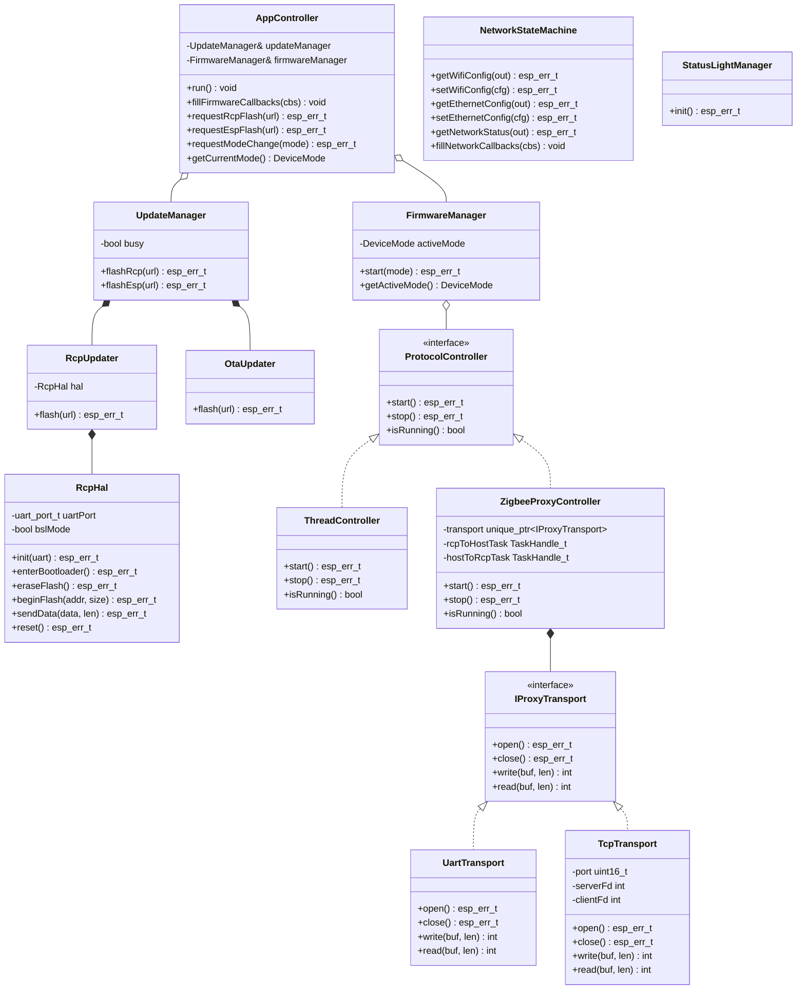
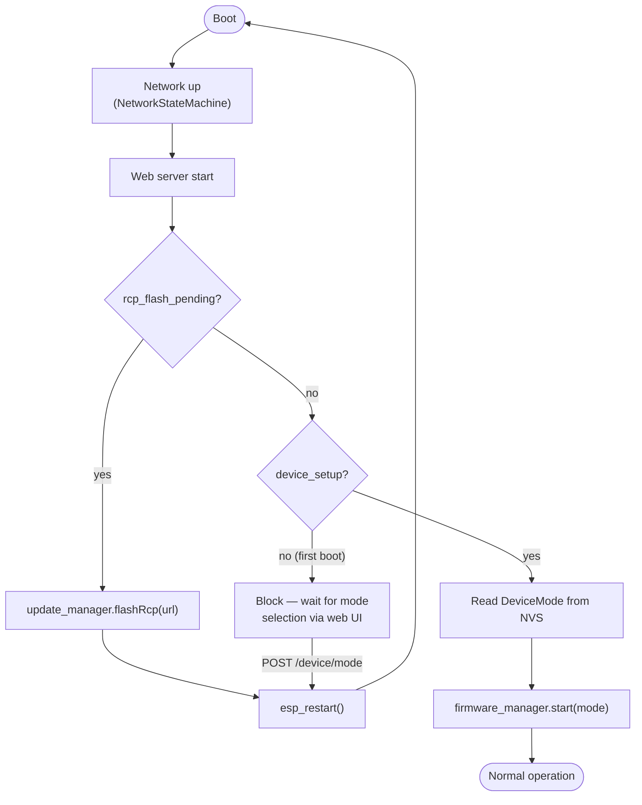

# CZC - OpenThreadBorderRouter Firmware ALPHA

This Firmware is in the ALPHA Phase and far away from being complete!

## Known Issues

This firmware is in an early alpha stage. Known issues are tracked as
[GitHub Issues](https://github.com/codm/czc-ot-fw/issues). If you run into a
problem that isn't listed there, please open a new issue with as much detail
as possible (firmware version, steps to reproduce, log output).

Known Issues:

- Firmware downloads over a Wi-Fi connection are not yet possible (LAN only).
- Long startup time on first boot, caused by the RCP firmware download and flash process.
- No visual feedback on the CZC during setup or firmware updates.
- The web interface is unreachable if the RCP is not configured correctly.
- SoftAP network scanning does not work.
- SoftAP closes after invalid or non-existent network credentials are submitted.
- Feedback messages in the SoftAP configuration flow are unclear.

### Capturing Debug Output

When reporting an issue, serial log output is extremely helpful. Each release provides a
**debug build** with verbose logging enabled (see [Setup](#setup)) — please use this
build when capturing logs.

1. **Install a serial terminal**, e.g. [CoolTerm](https://freeware.the-meiers.org/) (or
   any other serial terminal of your choice).

2. **Connect the CZC**: plug it into your PC via USB (serial console) and into your
   network via a LAN cable.

   Once booted, the web interface is reachable at [http://codm-otbr.local](http://codm-otbr.local).

3. **Configure CoolTerm**:
   - Open "Options".
   - Under "Port", select the USB port the CZC is connected to.
   - Set the baud rate to **115200**.
   - Leave all other settings at their default values.
   - Click "OK", then "Connect".

   On Windows the COM port can be found in the Device Manager. On Linux it is usually
   listed under `/dev/ttyUSBx` (FTDI).

4. **Reproduce the issue** you want to report.

5. **Save the serial output**: CoolTerm shows all debug prints sent by the ESP. For
   longer captures, enable **Connection → File Capture** beforehand to log everything to
   a file.

   Please attach the captured output to your issue report.

## Setup

1. Download the Binary from the Releases Tab. Make sure that you pick the firmware without the .ota suffix!

> NOTE: Each release provides two firmware variants — a **release build** (default,
> minimal logging) and a **debug build** (verbose serial logging). Use the debug build if
> you want to troubleshoot an issue or need to capture logs for a bug report, see
> [Capturing Debug Output](#capturing-debug-output).

2. Connect your CZC to LAN
> IMPORTANT NOTE: Currently ESP, RCP Firmware Updates are only supported via LAN. 

3. Open [ESP Webflasher](https://docs.codm.de/en/zigbee/coordinator/web-installer/). Pick the appropriate OTBR Firmware Version.

4. Wait a few minuets until your ESP32 has successfully setup and started its Webinterface (This can take a while depending on your internet connection speed). 
> NOTE: After the first flash the ESP automatically Downloads the RCP firmware and flashes the Radio-Co-Processor. This does not yet have a visual output besides Debug prints.

5. Open [http://codm-otbr.local](http://codm-otbr.local) and you can start setting up a Thread Network!

## WiFi / SoftAP

When no WiFi is configured and no Ethernet connection is available, the CZC opens an Access Point named `otbr-codm` with password `codmcodm`.

Connect to the AP and open **[http://192.168.4.1](http://192.168.4.1)** — the full web interface is served directly (no separate captive portal). Go to the **Network** section to configure WiFi credentials or a static Ethernet IP.

Once internet connectivity is established, the device switches to normal operation mode automatically.

## Home Assistant Integration (Thread Border Router & Matter)

This guide explains how to integrate your CZC border router into Home Assistant using Thread and Matter over Thread.

---

### Prerequisites

- Home Assistant installed and running (on the same local network as your device)
- Home Assistant Companion App installed on your smartphone
- **Bluetooth enabled** on your smartphone (required for the pairing process)
- Your smartphone must be connected to the **same local network** as Home Assistant

---

### Step 1 — Install the Thread Integration

1. In Home Assistant, navigate to **Settings → Devices & Services**.
2. Click **+ Add Integration** and search for **Thread**.
3. Install the Thread integration.

---

### Step 2 — Add a Thread Border Router

1. In **Settings → Devices & Services**, click the **gear icon (⚙)** next to the Thread integration to open its settings.
2. Click the **three-dot menu (⋮)** in the top-right corner.
3. Select **Add Thread Border Router** and follow the on-screen instructions.
4. You will be prompted fill in the URL of the OTBRs REST API: `http://device-ip` or `http://codm-otbr.local`.
5. Once added, open the border router's details and select **Make Preferred Network** to designate it as the primary Thread network.

---

### Step 3 — Install the Matter Integration (for Matter over Thread)

If your device uses **Matter over Thread**, you also need the Matter integration:

1. Navigate to **Settings → Devices & Services**.
2. Click **+ Add Integration**, search for **Matter**, and install it.
3. During setup, you will also be prompted to install the **Matter Server** (the commissioner add-on). Install it and wait for it to start — this component handles all Matter commissioning and communication.

---

### Step 4 — Connect Your Device

1. Open the **Home Assistant Companion App** on your smartphone.
2. Go to **Settings → Companion App → Troubleshooting → Synchronize Thread Credentials**. This ensures your phone shares the Thread network credentials with Home Assistant so it can act as a commissioning bridge.
3. Back in Home Assistant, go to **Settings → Devices & Services → Devices** and click **+ Add Device**.
4. **Put your device into pairing mode** (refer to your device's documentation for how to do this).
5. **Scan the QR code** displayed on or shipped with your device to complete commissioning.

---

### Troubleshooting

#### Pairing fails or device is not found

- Make sure **Bluetooth is enabled** on your phone — it is required during the commissioning process even if the device ultimately connects via Thread.
- Confirm your phone is on the **same local network** as your Home Assistant instance.
- Try **clearing the cache** of the Home Assistant Companion App: on Android go to *App Info → Storage → Clear Cache*; on iOS, delete and reinstall the app. This resolves stale credential or state issues in the app.

#### Pairing fails due to IPv6 not being enabled

Thread requires IPv6. If pairing fails immediately, the cause is often that IPv6 is not enabled inside the **Docker container that runs the Thread integration within Home Assistant**. Note that this is unrelated to whether Home Assistant itself is running in Docker — it specifically concerns the internal Thread container that Home Assistant manages.

**There is currently no UI option for this — it must be changed from the command line.**

For full details refer to the official documentation: [https://www.home-assistant.io/integrations/thread/#home-assistant-operating-system](https://www.home-assistant.io/integrations/thread/#home-assistant-operating-system)

To check and enable IPv6:

1. Open the **Terminal & SSH** add-on (or any equivalent terminal app).

2. Check the current setting:
   ```
   ha docker info
   ```
   If `enable_ipv6` shows `null` or `false`, proceed to the next step.

3. Enable IPv6 for the Docker environment Home Assistant uses:
   ```
   ha docker options --enable-ipv6=true
   ```

4. Reboot Home Assistant for the change to take effect:
   ```
   ha host reboot
   ```

> **Note:** If Home Assistant OS is running inside a virtual machine, make sure the VM itself has IPv6 connectivity. If your hypervisor is routing traffic (rather than bridging), IPv6 forwarding may also need to be enabled on the hypervisor — refer to your hypervisor's documentation for instructions.

---

## Overview

Multi-mode coordinator firmware for the cod.m CZC device (ESP32 + CC2652P7 RCP). Supported modes:

| Mode | Description |
|---|---|
| **Thread OTBR** | OpenThread Border Router — connects a Thread mesh to IP |
| **Zigbee Coordinator USB** | Serial proxy over USB to a host application (e.g. Zigbee2MQTT) |
| **Zigbee Coordinator Network** | TCP proxy to a network host application |
| **Zigbee Router** | Standalone Zigbee router — RCP operates independently |

The active mode is selected on first boot via the web interface. Changing mode re-flashes the RCP with the matching firmware and reboots the device.

The OpenThread stack is based on the [Espressif OTBR example](https://github.com/espressif/esp-idf/blob/master/examples/openthread/ot_br/README.md).

## How to use Border Router

### Hardware Required
#### **Wi-Fi based Thread Border Router**

ESP32 pin | CC2652P7 pin
----------|-------------
   GND    |      G
   GPIO4  |      TX
   GPIO36 |      RX
   GPIO16 |      HW_RST

Firmware Baud: 921600

### Configure the project

```
idf.py menuconfig
```
OpenThread Command Line is enabled with UART as the default interface. Additionally, USB JTAG is also supported and can be activated through the menuconfig:

```
Component config → ESP System Settings → Channel for console output → USB Serial/JTAG Controller
```

#### Setup Repository

1. Clone the github repository

2. You need a .vscode folder in your Repository normally generated from the espressif IDF

   The files in this folder tell your development environment where your IDF etc. are installed on your device.

   **We suggest that you copy this folder from an example project created with your IDF if not automatically generated after clone.**

3. The required `dependencies.lock` file should get generated automatically while building the project. 

   If you encounter issues regarding the `webserver` component try adding the following lines under `dependencies:`

   ```yaml
      esp_ot_br_server:
         dependencies:
         - name: espressif/cjson
           rules:
           - if: idf_version >= 6.0
           version: ^1.7.19
         source:
           path: /$PROJ_PATH/ot_br/components/esp_ot_br_server
           type: local
         version: '*'
   ```

   and add `esp_ot_br_server` to the `direct_dependencies:` object. 

After these changes you should be able to build the project.

Before building and flashing it to your ESP you have to make a few changes to your IDF or you will get these errors:

```
E(1550) OPENTHREAD:[C] P-RadioSpinel-: RCP is missing required capabilities: 
E(1550) OPENTHREAD:[C] P-RadioSpinel-:     rx-timing
E(1550) OPENTHREAD:[C] P-RadioSpinel-:     rx-on-when-idle
```

- `rx-on-when-idle` has to be deactivated: -> Component config → OpenThread → Thread Core Features → Disable OpenThread radio capability rx on when idle

- more importantly: `rx-timing` is hardcoded in the espressif openthread sdk. In `$IDF_PATH/esp-idf/components/openthread/src/port/esp_openthread_radio_spinel.cpp` the constant `OT_RADIO_CAPS_RECEIVE_TIMING` part of the `s_radio_caps` object has do be deleted. 

Now you can build and flash the project to your ESP and the border router should initialize properly.

### Build, Flash, and Run

Build the project and flash it to the board, then run monitor tool to view serial output:

```
idf.py -p PORT build flash monitor
```

## Project Documentation

This Chapter gives Architectural and specific Project coding Documentation

### File Structure

```
czc_ot_firmware/
├── main/
│   └── main.cpp                  Boot sequence, wires all components
│
├── components/
│   ├── app_controller/           Composition root + boot orchestrator
│   │   ├── include/app_controller.h
│   │   ├── private_include/app_nvs.h
│   │   └── src/app_controller.cpp, app_nvs.cpp
│   │
│   ├── update_manager/           RCP (BSL) + ESP (OTA) firmware updates
│   │   ├── include/update_manager.h
│   │   ├── private_include/rcp_hal.h, rcp_updater.h, ota_updater.h
│   │   └── src/
│   │
│   ├── firmware_manager/         Protocol stack selection (Thread / Zigbee)
│   │   ├── include/firmware_manager.h   ← DeviceMode enum
│   │   ├── private_include/protocol_controller.h, thread_controller.h,
│   │   │                               zigbee_proxy_controller.h, proxy_transport.h
│   │   └── src/
│   │
│   ├── status_light/             Event-driven LED manager (zero upstream deps)
│   │   ├── include/status_light_event.h, status_light_manager.h, status_light_hal.h
│   │   └── src/
│   │
│   ├── board_config/             Hardware constants in Board:: namespace
│   │   └── include/board_config.h
│   │
│   ├── network/                  Ethernet + WiFi state machine
│   │   └── include/NetworkStateMachine.h, network_config.h, nvs_bind.h
│   │
│   └── esp_ot_br_server/         HTTP server + web frontend (C)
│       ├── include/esp_br_web.h  ← web callback structs + esp_br_web_start()
│       └── frontend/             HTML/JS/CSS (gzip-compressed into SPIFFS)
│           └── static/restful.js ← RCP flash dialog: Thread / Zigbee Coordinator / Zigbee Router tabs
│
└── partitions.csv                Flash partition table
```

#### Components

##### `app_controller`

Composition root. Runs the boot-decision-tree on every boot and routes web API requests to the appropriate sub-manager. Owns all NVS keys for boot state (`device_setup`, `rcp_pending`, `rcp_url`, `device_mode`) via the private `AppNvs` namespace.

##### `update_manager`

Wraps two updaters with different execution models:
- **`RcpUpdater`** — downloads TI binary into the OTA staging partition, then drives the CC2652 BSL over UART (`RcpHal`). Runs at boot-time only.
- **`OtaUpdater`** — thin `esp_https_ota` wrapper for live ESP firmware updates.

Both use the same OTA partition; a `busy` flag prevents simultaneous access.

##### `firmware_manager`

Selects and starts the correct `ProtocolController` implementation based on `DeviceMode`:
- `ThreadController` — OTBR stack (Spinel over UART).
- `ZigbeeProxyController` — transparent serial proxy (USB or TCP). Pumps bytes between the RCP UART and an `IProxyTransport` implementation (`UartTransport` for USB, `TcpTransport` for TCP) using two FreeRTOS tasks.

##### `status_light`

Event-driven LED manager. Other components post `LedState` events; the manager applies priority arbitration and drives the GPIO LEDs via a 100 ms `esp_timer` tick. See [`components/status_light/README.md`](components/status_light/README.md).

##### `network`

Ethernet / WiFi / SoftAP state machine. Extended with `getWifiConfig()`, `setWifiConfig()`, `getEthernetConfig()`, `setEthernetConfig()`, `getNetworkStatus()` and `fillNetworkCallbacks()`. NVS bindings in `NvsBinding` namespace support full IP configuration (DHCP / static IP / gateway / DNS).

##### `esp_ot_br_server`

HTTP server providing the OpenThread REST API and the web GUI. Defines two C callback structs (`web_firmware_callbacks_t` in `esp_br_web.h`, `web_network_callbacks_t` in `network_config.h`) that decouple it from the C++ application layer.

### Flash Partition Layout

The firmware uses a custom partition table ([`partitions.csv`](partitions.csv)) that enables dual-bank OTA updates and reserves a small SPIFFS partition for the web GUI assets.

| Name | Type | Offset | Size (hex) | Size (bytes) | Size |
|---|---|---|---|---|---|
| `nvs` | NVS data | `0x009000` | `0x6000` | 24,576 | 24 KB |
| `phy_init` | PHY calibration | `0x00F000` | `0x1000` | 4,096 | 4 KB |
| `ota_0` | App (OTA slot 0) | `0x010000` | `0x1F0000` | 2,031,616 | ~1.94 MB |
| `ota_1` | App (OTA slot 1) | `0x200000` | `0x1F0000` | 2,031,616 | ~1.94 MB |
| `ota_data` | OTA boot selector | `0x3F0000` | `0x2000` | 8,192 | 8 KB |
| `spiffs` | Web GUI assets | `0x3F2000` | `0xE000` | 57,344 | 56 KB |
| **Total** | | | | **4,194,304** | **4 MB** |

**OTA update flow:** The ESP-IDF OTA mechanism alternates between `ota_0` and `ota_1`. The `ota_data` partition records which slot is active. A `/flash/esp` OTA update writes the new image into the *inactive* slot and switches the `ota_data` pointer — the previously running firmware remains intact in the other slot until the next update.

**SPIFFS:** Holds the gzip-compressed web GUI files (`index.html`, `restful.js`, `style.css`). The `wifi_configuration.html` is additionally embedded directly into the app binary as a fallback. See [`components/esp_ot_br_server/README.md`](components/esp_ot_br_server/README.md) for details on the build process.

> **Note:** Switching between the OTBR and the CZC Zigbee firmware over-the-air is not yet possible because the two firmwares use different partition layouts. See [Zigbee to OTBR complications](#zigbee-to-otbr-complications) for details.

---

### Class Diagram



### Boot-Decision-Tree



### API Endpoints

| Method | Path | Description |
|---|---|---|
| `POST` | `/flash/rcp` | Schedule RCP firmware update (NVS intent + reboot) |
| `POST` | `/flash/esp` | Start live ESP OTA update |
| `GET` | `/device/mode` | Returns `{"mode": <int>, "device_setup": <bool>}` |
| `POST` | `/device/mode` | Set device mode — `{"mode": <int>}` |
| `GET` | `/network/wifi` | Read WiFi config from NVS |
| `POST` | `/network/wifi` | Write WiFi config + trigger reconnect |
| `GET` | `/network/ethernet` | Read Ethernet config from NVS |
| `POST` | `/network/ethernet` | Write Ethernet config + trigger reinit |
| `GET` | `/network/status` | Returns `{"mode": <int>, "ip": "<str>", "connected": <bool>}` |
| `GET` | `/get_properties` | OpenThread network properties |
| `GET/DELETE` | `/node` | OpenThread node info |
| `GET/PUT` | `/node/dataset/active` | Active Thread dataset |
| `GET` | `/available_network` | Scan for Thread networks |
| `POST` | `/join_network` | Join a Thread network |
| `POST` | `/form_network` | Form a new Thread network |
| `GET` | `/topology` | Thread network topology |

#### Bridging the C web server and the C++ application

The web server (`esp_br_web.c`) is plain C. It receives two C callback structs at startup that forward web API requests to the C++ application layer without knowing anything about it:

```c
// Filled by AppController::fillFirmwareCallbacks() — ctx = AppController*
typedef struct { ...; void *ctx; } web_firmware_callbacks_t;  // esp_br_web.h

// Filled by NetworkStateMachine::fillNetworkCallbacks() — ctx = NetworkStateMachine*
typedef struct { ...; void *ctx; } web_network_callbacks_t;   // network_config.h
```

`main.cpp` wires both before starting the web server:
```cpp
web_firmware_callbacks_t fwCbs{};
appController.fillFirmwareCallbacks(&fwCbs);

web_network_callbacks_t netCbs{};
network.fillNetworkCallbacks(&netCbs);

esp_br_web_start("/spiffs", &fwCbs, &netCbs);
```

HTTP handlers parse the JSON body and call the matching function pointer. `AppController` and `NetworkStateMachine` remain invisible to the web server.

### Firmware Flash

Both flash endpoints reboot the device once the update has been applied.

- **ESP firmware (`/flash/esp`)** — A standard ESP-IDF **OTA update**: the new image is
  streamed directly into the inactive `ota_0`/`ota_1` partition via `esp_https_ota_*`,
  the boot partition is switched, and the device reboots into the new firmware.
  Handled by `OtaUpdater` (in `update_manager`).

- **RCP firmware (`/flash/rcp`)** — The CC2652P7 cannot be updated over HTTP directly.
  `AppController::requestRcpFlash()` writes the URL and a pending flag to NVS, then
  reboots. On the next boot, `AppController::run()` detects the pending flag and calls
  `UpdateManager::flashRcp()`, which:
  1. Downloads the TI binary over HTTPS into the OTA staging partition (`RcpUpdater`).
  2. Drives the CC2652 BSL over UART (`RcpHal`): sync → bank-erase → download → send-data → reset.
  
  The OTA partition is used as raw byte storage for the RCP binary — the ESP's own firmware is never modified during an RCP flash.

#### Github Download

Downloading firmware from GitHub servers is more complex than just downloading a file
from a local webserver hosted via Python.

You have to follow redirects and provide certificates for HTTPS.

It is also important to keep in mind that GitHub enforces a rate limit of 60 requests per
hour. Because of this it is better to host the firmware yourself rather than downloading
and fetching it from GitHub every time.

### Zigbee to OTBR complications

This OTBR firmware and the existing CZC Zigbee firmware currently use **different
partition tables**:

- OTBR (this repository): [`partitions.csv`](partitions.csv) — OTA-enabled, with
  `ota_0`/`ota_1` app partitions, an `ota_data` partition for the boot selector, and a
  `spiffs` partition for the web GUI.
- Zigbee firmware: partition table is generated automatically by PlatformIO at build
  time — no static `.csv` is checked into its repository.

An OTA flash via `/flash/esp` only overwrites the application binary inside the
*currently running* app partition — it does **not** rewrite the partition table itself.
Because the two firmwares currently use incompatible partition layouts, a device cannot
simply be switched between the Zigbee and the OTBR firmware over the air; doing so still
requires a full reflash via USB/serial.

For a remote, OTA-only switch between the Zigbee and OTBR firmware (without USB/laptop),
both firmwares need to share the same partition table. **This is work in progress** —
the Zigbee firmware's partition table will be adapted to match `partitions.csv` in a
future release.
