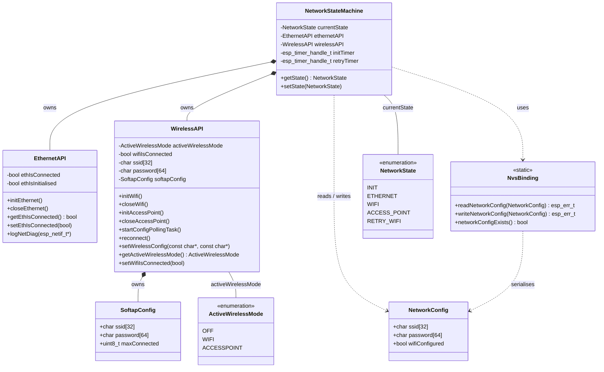
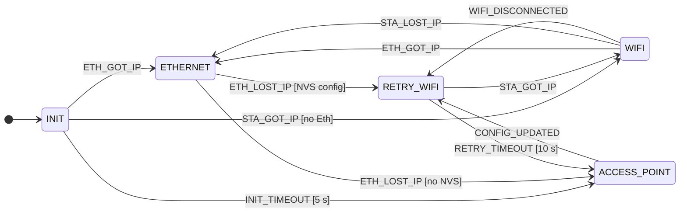

# Network Component

Manages network connectivity for the CODM OTBR device. A state machine coordinates
between Ethernet, WiFi (STA), and a configuration AccessPoint, persisting credentials
in NVS.

---

## Architecture

---

## State Machine

> **Event prefix:** `ETH_GOT_IP` = `IP_EVENT_ETH_GOT_IP`, `STA_GOT_IP` = `IP_EVENT_STA_GOT_IP`,
> `WIFI_DISCONNECTED` = `NETWORK_EVENT_WIFI_DISCONNECTED`, etc.
>
> **`CONFIG_UPDATED`** (`NETWORK_EVENT_CONFIG_UPDATED`) can fire from any active state —
> it always tears down the current interface and transitions to `RETRY_WIFI`.

---

### States

| State | Description |
|---|---|
| `INIT` | Boot state. Ethernet starts immediately; WiFi starts if NVS credentials exist. A 5-second timer runs — if no interface delivers an IP the AccessPoint opens. |
| `ETHERNET` | Ethernet is the active uplink with a valid IP. |
| `WIFI` | WiFi STA is the active uplink with a valid IP. |
| `RETRY_WIFI` | WiFi is connecting or reconnecting. A 10-second timer runs; on expiry the AccessPoint reopens. Entered whenever a WiFi connection attempt is needed, regardless of the previous state. |
| `ACCESS_POINT` | No usable uplink. A SoftAP + config webserver is open so the user can submit WiFi credentials. |

---

### Connection Routes

**1 — Boot → Ethernet**
`INIT → ETHERNET`
Ethernet cable present at boot. `IP_EVENT_ETH_GOT_IP` arrives before the 5-second init timeout.

**2 — Boot → WiFi**
`INIT → WIFI`
NVS holds credentials, WiFi connects, and `IP_EVENT_STA_GOT_IP` arrives before the 5-second timeout without Ethernet being active.

**3 — Boot → AccessPoint**
`INIT → ACCESS_POINT`
Neither Ethernet nor WiFi delivers an IP within 5 seconds. The AccessPoint opens for initial setup.

**4 — AccessPoint → WiFi (credentials accepted)**
`ACCESS_POINT → RETRY_WIFI → WIFI`
User submits credentials via the config webserver. WiFi connects and an IP is obtained within 10 seconds.

**5 — AccessPoint → AccessPoint (wrong credentials)**
`ACCESS_POINT → RETRY_WIFI → ACCESS_POINT`
Credentials submitted but the connection fails or the 10-second retry window expires. The AccessPoint reopens so the user can try again.

**6 — WiFi disconnect → reconnect**
`WIFI → RETRY_WIFI → WIFI`
WiFi drops (e.g. brief router outage). The connection is restored within the 10-second retry window.

**7 — WiFi disconnect → timeout**
`WIFI → RETRY_WIFI → ACCESS_POINT`
WiFi drops and cannot reconnect within 10 seconds. The AccessPoint reopens.

**8 — Ethernet takes over from WiFi**
`WIFI → ETHERNET`
Ethernet cable is plugged in while WiFi is active. `IP_EVENT_ETH_GOT_IP` triggers a switch; WiFi is closed.

**9 — WiFi IP lost**
`WIFI → ETHERNET`
`IP_EVENT_STA_LOST_IP` is received. The state machine falls back to Ethernet.

**10 — Ethernet lost, WiFi fallback**
`ETHERNET → RETRY_WIFI → WIFI`
Ethernet loses its IP and NVS credentials exist. WiFi starts and obtains an IP within 10 seconds.

**11 — Ethernet lost, no WiFi config**
`ETHERNET → ACCESS_POINT`
Ethernet loses its IP and no NVS credentials are stored. The AccessPoint opens.

**12 — WiFi config update**
`* → RETRY_WIFI → WIFI / ACCESS_POINT`
`NETWORK_EVENT_CONFIG_UPDATED` tears down the current interface from any state, writes the new credentials to NVS, and starts a fresh WiFi connection attempt through `RETRY_WIFI`.

---

## NVS Storage

Namespace: `wifi_cfg` — Keys: `ssid`, `password`, `configured`

| Event | NVS operation |
|---|---|
| First successful WiFi IP (`IP_EVENT_STA_GOT_IP`) | `writeNetworkConfig()` |
| Boot with stored config | `readNetworkConfig()` → `setWirelessConfig()` → `initWifi()` |
| Ethernet lost, config present (`IP_EVENT_ETH_LOST_IP`) | `readNetworkConfig()` → `setWirelessConfig()` |
