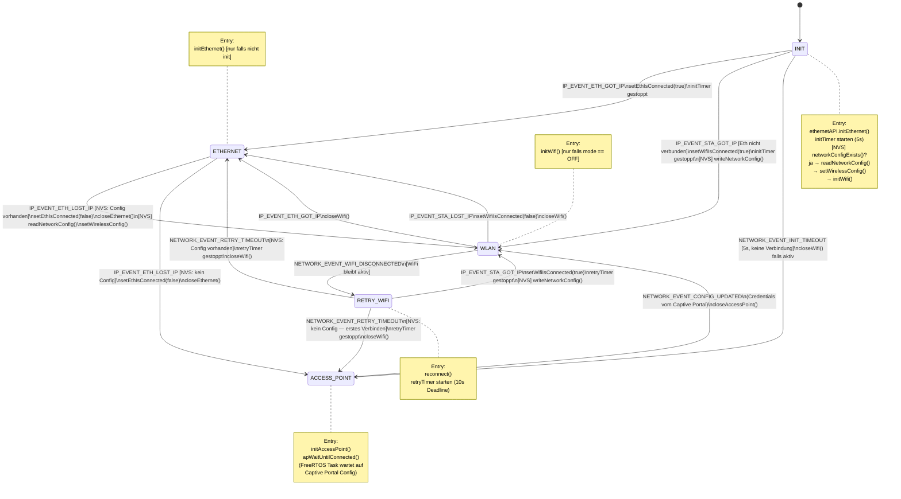

# Network Component

## State Machine

**NVS Namespace:** `wifi_cfg` — Keys: `ssid`, `password`, `configured`

---

## Manuelle Test-Routine

### 1 — Kaltstart ohne Ethernet, ohne WiFi-Config (NVS leer)
- Board booten, kein Ethernet, kein gespeichertes WiFi
- **Erwartung:** Nach ~5s öffnet sich der AccessPoint
- Mit Handy/Laptop nach SSID scannen → AP sichtbar

### 2 — WiFi über AccessPoint konfigurieren
- Mit AP verbinden, Webserver öffnen, SSID + Passwort eingeben
- **Erwartung:** AP schließt sich, Board versucht WiFi-Verbindung → Log zeigt `WLAN` State

### 3 — WiFi-Verbindung kurz unterbrechen (Router kurz aus/an)
- Im WLAN-State: Router kurz ausschalten (~3s), wieder einschalten
- **Erwartung:** Board geht in RETRY_WIFI, versucht reconnect, bekommt IP zurück → zurück in WLAN
- Log: `Wifi disconnected -> starting retry timer` → `Wifi got IP -> changed mode to Wifi`

- Im WLAN-State: Router aus, **nicht** wieder einschalten
- **Erwartung:** Nach ~10s Retry-Timeout → AccessPoint öffnet sich wieder (da `nvsWifiConfigExists = false`)
- Log: `First connection attempt timed out, no stored config -> reopening AccessPoint`

### 5 — Kaltstart mit Ethernet
- Board booten, Ethernet-Kabel eingesteckt

- **Erwartung:** Vor 5s-Timeout kommt `IP_EVENT_ETH_GOT_IP` → State wechselt zu ETHERNET, kein AP öffnet sich
- Log: `Ethernet got IP -> changed mode to Ethernet`

### 6 — Ethernet während WiFi-Betrieb einstecken
- Im WLAN-State: Ethernet-Kabel einstecken
- **Erwartung:** `IP_EVENT_ETH_GOT_IP` → State wechselt zu ETHERNET, WiFi wird geschlossen
- Log: `Ethernet got IP -> changed mode to Ethernet`

### 7 — Ethernet abziehen (mit gespeichertem WiFi)
- Im ETHERNET-State: Kabel abziehen, NVS Config vorhanden
- **Erwartung:** `IP_EVENT_ETH_LOST_IP` → `readNetworkConfig()` → State wechselt zu WLAN
- Log: `Ethernet lost IP -> WiFi config found, switching to Wifi`

### 8 — Ethernet abziehen (ohne WiFi-Config)
- Im ETHERNET-State: Kabel abziehen, NVS leer
- **Erwartung:** `IP_EVENT_ETH_LOST_IP` → AccessPoint öffnet sich
- Log: `Ethernet lost IP -> no WiFi config, opening AccessPoint`

### 9 — WiFi-Config ändern während WLAN aktiv
- Im WLAN-State: `NETWORK_EVENT_CONFIG_UPDATED` triggern (z.B. über den Webserver)
- **Erwartung:** WiFi schließt sich, State wechselt zu WLAN und verbindet mit neuer Config

### 10 — Reboot / `closeNetworkStateMachine()` aufrufen
- Während Retry-Timer läuft: Board rebooten oder close aufrufen
- **Erwartung:** Kein Crash, Timer wird sauber gestoppt und gelöscht
