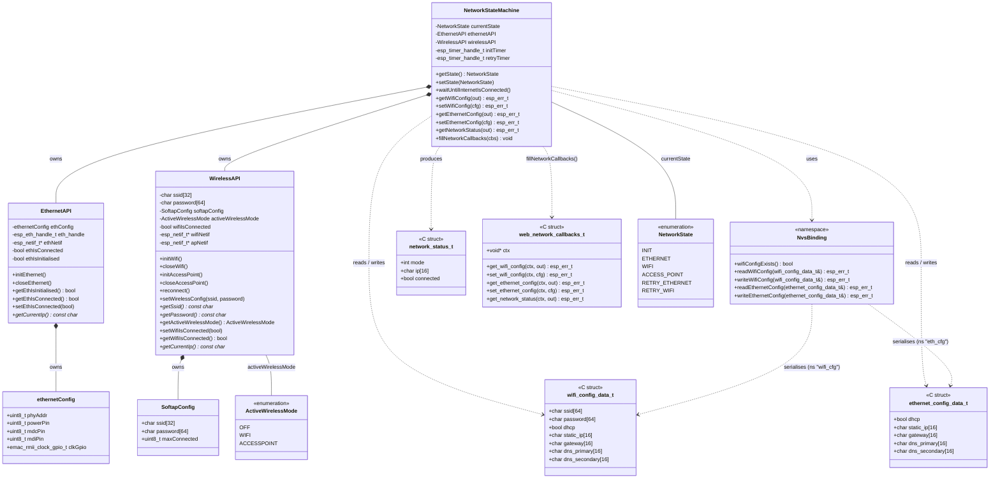
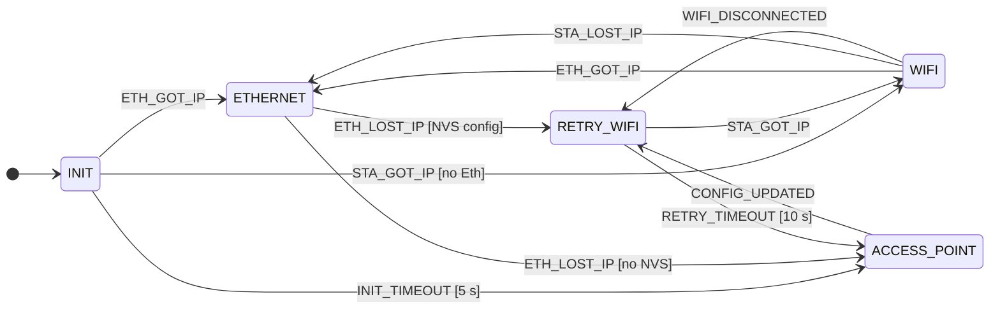

# Network Component

Manages network connectivity for the CODM OTBR device. A state machine coordinates
between Ethernet, WiFi (STA), and a configuration AccessPoint, persisting credentials
and IP settings in NVS. Exposes a C callback bridge (`web_network_callbacks_t`) so the
plain-C web server can read/write config and status without depending on C++.

---

## Architecture

> **Web bridging:** `NetworkStateMachine::fillNetworkCallbacks()` fills a
> `web_network_callbacks_t` with static lambdas closing over `this` (passed as `ctx`),
> handed to `esp_br_web_start()` before the HTTP server starts (see main
> [README → Bridging the C web server and the C++ application](../../README.md#bridging-the-c-web-server-and-the-c-application)).
> The REST endpoints this backs (`/network/wifi`, `/network/ethernet`, `/network/status`)
> are listed in the main [README → API Endpoints](../../README.md#api-endpoints).

---

## State Machine

> **Event prefix:** `ETH_GOT_IP` = `IP_EVENT_ETH_GOT_IP`, `STA_GOT_IP` = `IP_EVENT_STA_GOT_IP`,
> `WIFI_DISCONNECTED` = `NETWORK_EVENT_WIFI_DISCONNECTED`, etc.
>
> **`CONFIG_UPDATED`** (`NETWORK_EVENT_CONFIG_UPDATED`, posted by `setWifiConfig()`) can
> fire from any active state — it always tears down the current interface (WiFi,
> AccessPoint, or Ethernet if no wireless mode was active) and transitions to
> `RETRY_WIFI` with the freshly written credentials.
>
> **`ETH_CONFIG_UPDATED`** (`NETWORK_EVENT_ETH_CONFIG_UPDATED`, posted by
> `setEthernetConfig()`) can also fire from any state. Unlike `CONFIG_UPDATED` it does
> **not** route through the retry states: it closes Ethernet if initialised, applies the
> new DHCP/static-IP settings directly to the `ETH_DEF` netif, re-initialises Ethernet,
> and jumps straight to `INIT` — re-running the same 5 s boot race between Ethernet and
> WiFi used at startup. WiFi/AccessPoint are left untouched.
>
> **`RETRY_ETHERNET`** is declared in `NetworkState` and has exit/enter handling wired
> (mirrors `RETRY_WIFI`'s 10 s timer) but no transition currently targets it — nothing
> posts an event that would move the machine into this state. It exists for a planned
> Ethernet-reconnect path symmetric to `RETRY_WIFI` and is effectively dead code today.

---

### States

| State | Description |
|---|---|
| `INIT` | Boot state. Ethernet starts immediately; WiFi starts if NVS credentials exist. A 5-second timer runs — if no interface delivers an IP the AccessPoint opens. |
| `ETHERNET` | Ethernet is the active uplink with a valid IP. |
| `WIFI` | WiFi STA is the active uplink with a valid IP. |
| `RETRY_WIFI` | WiFi is connecting or reconnecting. A 10-second timer runs; on expiry the AccessPoint reopens. Entered whenever a WiFi connection attempt is needed, regardless of the previous state. |
| `RETRY_ETHERNET` | Declared for a symmetric Ethernet-reconnect flow; exit/enter logic exists but is currently unreachable (see note above). |
| `ACCESS_POINT` | No usable uplink. A SoftAP is open at `192.168.4.1`; the main web server (already running, see [main README → WiFi / SoftAP](../../README.md#wifi--softap)) serves the config UI directly — there is no separate captive-portal webserver. |

---

### Connection Routes

**1 — Boot → Ethernet**
`INIT → ETHERNET`
Ethernet cable present at boot. `IP_EVENT_ETH_GOT_IP` arrives before the 5-second init timeout.

**2 — Boot → WiFi**
`INIT → WIFI`
NVS holds credentials, WiFi connects, and `IP_EVENT_STA_GOT_IP` arrives before the 5-second timeout without Ethernet being active.

**3 — Boot → AccessPoint**
`INIT → ACCESS_POINT`
Neither Ethernet nor WiFi delivers an IP within 5 seconds. The AccessPoint opens for initial setup.

**4 — AccessPoint → WiFi (credentials accepted)**
`ACCESS_POINT → RETRY_WIFI → WIFI`
User submits credentials via `POST /network/wifi`. WiFi connects and an IP is obtained within 10 seconds.

**5 — AccessPoint → AccessPoint (wrong credentials)**
`ACCESS_POINT → RETRY_WIFI → ACCESS_POINT`
Credentials submitted but the connection fails or the 10-second retry window expires. The AccessPoint reopens so the user can try again.

**6 — WiFi disconnect → reconnect**
`WIFI → RETRY_WIFI → WIFI`
WiFi drops (e.g. brief router outage). The connection is restored within the 10-second retry window.

**7 — WiFi disconnect → timeout**
`WIFI → RETRY_WIFI → ACCESS_POINT`
WiFi drops and cannot reconnect within 10 seconds. The AccessPoint reopens.

**8 — Ethernet takes over from WiFi**
`WIFI → ETHERNET`
Ethernet cable is plugged in while WiFi is active. `IP_EVENT_ETH_GOT_IP` triggers a switch; WiFi is closed.

**9 — WiFi IP lost**
`WIFI → ETHERNET`
`IP_EVENT_STA_LOST_IP` is received. The state machine falls back to Ethernet.

**10 — Ethernet lost, WiFi fallback**
`ETHERNET → RETRY_WIFI → WIFI`
Ethernet loses its IP and NVS credentials exist. WiFi starts and obtains an IP within 10 seconds.

**11 — Ethernet lost, no WiFi config**
`ETHERNET → ACCESS_POINT`
Ethernet loses its IP and no NVS credentials are stored. The AccessPoint opens.

**12 — WiFi config update**
`* → RETRY_WIFI → WIFI / ACCESS_POINT`
`NETWORK_EVENT_CONFIG_UPDATED` (posted by `POST /network/wifi`) tears down the current interface from any state, writes the new credentials to NVS, and starts a fresh WiFi connection attempt through `RETRY_WIFI`.

**13 — Ethernet config update**
`* → INIT`
`NETWORK_EVENT_ETH_CONFIG_UPDATED` (posted by `POST /network/ethernet`) applies the new DHCP/static-IP settings to the Ethernet netif and re-runs the `INIT` boot race, without touching WiFi/AccessPoint. See the `ETH_CONFIG_UPDATED` note above.

---

## NVS Storage

| Namespace | Keys | Struct |
|---|---|---|
| `wifi_cfg` | `ssid`, `password`, `configured`, `dhcp`, `static_ip`, `gateway`, `dns_pri`, `dns_sec` | `wifi_config_data_t` |
| `eth_cfg` | `dhcp`, `static_ip`, `gateway`, `dns_pri`, `dns_sec` | `ethernet_config_data_t` |

| Event | NVS operation |
|---|---|
| First successful WiFi IP (`IP_EVENT_STA_GOT_IP`) | `readWifiConfig()` (preserve DHCP/IP/DNS) → update `ssid`/`password` → `writeWifiConfig()` |
| Boot with stored WiFi config | `readWifiConfig()` → `setWirelessConfig()` → `initWifi()` |
| Ethernet lost, WiFi config present (`IP_EVENT_ETH_LOST_IP`) | `readWifiConfig()` → `setWirelessConfig()` |
| `POST /network/wifi` | `writeWifiConfig()` → posts `NETWORK_EVENT_CONFIG_UPDATED` |
| `POST /network/ethernet` | `writeEthernetConfig()` → posts `NETWORK_EVENT_ETH_CONFIG_UPDATED` |
| `NETWORK_EVENT_ETH_CONFIG_UPDATED` | `readEthernetConfig()` → applied to `ETH_DEF` netif (DHCP start/stop or static IP/gateway, `/24` netmask) |

`wifiConfigExists()` only checks the `configured` flag (set to `1` on first successful
`writeWifiConfig()`), not whether the namespace has any data — a partially-written
namespace without that flag is treated as "not configured".
